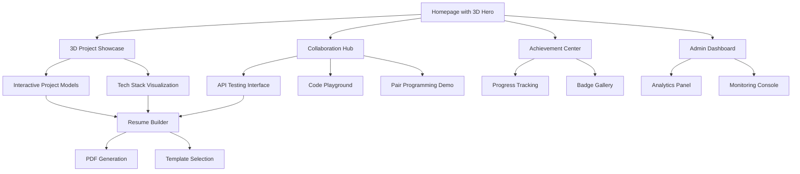

# Advanced Portfolio Features - Product Requirements Document

## 1. Product Overview

This document outlines the implementation of advanced interactive features for a modern portfolio website, including 3D visualizations, live collaboration tools, gamification elements, and comprehensive CI/CD pipeline. The goal is to create an industry-leading portfolio that showcases cutting-edge web technologies while maintaining exceptional performance and user experience.

- **Primary Purpose**: Transform a standard portfolio into an interactive, engaging platform that demonstrates advanced technical capabilities and provides unique user experiences.
- **Target Audience**: Potential employers, clients, collaborators, and fellow developers seeking to explore innovative web technologies.
- **Market Value**: Differentiate from standard portfolios through advanced features that showcase technical expertise and innovation.

## 2. Core Features

### 2.1 User Roles

| Role | Registration Method | Core Permissions |
|------|---------------------|------------------|
| Visitor | No registration required | Browse portfolio, view projects, basic interactions |
| Collaborator | GitHub OAuth integration | Access code playground, test APIs, real-time collaboration |
| Admin | Secure admin authentication | Full dashboard access, analytics, content management |

### 2.2 Feature Modules

Our advanced portfolio consists of the following main feature areas:

1. **3D Project Visualization**: Interactive Three.js showcase with WebGL animations and tech stack visualization
2. **Live Collaboration Hub**: API testing interface, code playground, and real-time pair programming demo
3. **Achievement System**: Gamified exploration with unlockable content and shareable badges
4. **Resume Builder**: Dynamic PDF generation with customizable templates and version control
5. **CI/CD Pipeline**: Automated testing, deployment, and monitoring with GitHub Actions
6. **Performance Dashboard**: Real-time analytics, monitoring, and optimization metrics
7. **Testing Suite**: Comprehensive test coverage including unit, integration, E2E, and accessibility tests
8. **Documentation Hub**: API docs, component storybook, and architectural decision records

### 2.3 Page Details

| Page Name | Module Name | Feature Description |
|-----------|-------------|--------------------|
| 3D Showcase | Three.js Renderer | Interactive 3D project models, tech stack visualization, smooth WebGL animations with camera controls |
| 3D Showcase | Project Viewer | Detailed project exploration in 3D space, interactive hotspots, embedded demos |
| Collaboration Hub | API Tester | Live API endpoint testing, request/response visualization, authentication handling |
| Collaboration Hub | Code Playground | Real-time code editor with syntax highlighting, live preview, collaborative editing |
| Collaboration Hub | Pair Programming | Screen sharing simulation, collaborative debugging, real-time chat integration |
| Achievement Center | Progress Tracker | Gamified exploration progress, unlock conditions, achievement notifications |
| Achievement Center | Badge Gallery | Shareable achievement badges, social media integration, progress visualization |
| Resume Builder | Template Engine | Dynamic PDF generation, customizable layouts, data binding from portfolio |
| Resume Builder | Version Control | Multiple resume versions, application tracking, template management |
| Admin Dashboard | Analytics Panel | Real-time visitor analytics, performance metrics, API usage statistics |
| Admin Dashboard | Monitoring Console | Error logs, deployment status, system health indicators, alert management |
| Testing Dashboard | Test Results | Live test execution results, coverage reports, performance benchmarks |
| Documentation | API Explorer | Interactive API documentation with Swagger UI, endpoint testing |
| Documentation | Component Library | Storybook integration, component documentation, usage examples |

## 3. Core Process

### Visitor Flow
1. **Entry**: Land on enhanced homepage with 3D hero section
2. **Exploration**: Navigate through 3D project showcase, unlock achievements
3. **Interaction**: Test APIs, use code playground, view live demos
4. **Engagement**: Share achievements, generate custom resume, provide feedback

### Collaborator Flow
1. **Authentication**: GitHub OAuth login for enhanced features
2. **Collaboration**: Access real-time code editing, pair programming demos
3. **Testing**: Use advanced API testing tools, contribute to open discussions
4. **Sharing**: Export collaboration results, share custom achievements

### Admin Flow
1. **Dashboard Access**: Secure admin login with multi-factor authentication
2. **Monitoring**: View real-time analytics, system performance, error logs
3. **Management**: Update content, manage user permissions, deploy updates
4. **Optimization**: Analyze performance metrics, implement improvements

## 4. User Interface Design

### 4.1 Design Style

- **Primary Colors**: Deep space blue (#0B1426), Electric cyan (#00D9FF), Neon green (#39FF14)
- **Secondary Colors**: Charcoal gray (#2D3748), Silver (#A0AEC0), Pure white (#FFFFFF)
- **Button Style**: Glassmorphism with subtle gradients, hover animations, 3D depth effects
- **Typography**: Inter for UI text (14-18px), JetBrains Mono for code (12-16px), Orbitron for headings (24-48px)
- **Layout Style**: Grid-based with floating panels, 3D card layouts, immersive full-screen sections
- **Icons**: Lucide React with custom 3D variants, animated state transitions, contextual color changes
- **Animations**: Framer Motion with spring physics, Three.js WebGL effects, smooth page transitions

### 4.2 Page Design Overview

| Page Name | Module Name | UI Elements |
|-----------|-------------|-------------|
| 3D Showcase | Three.js Canvas | Full-screen WebGL renderer, floating UI controls, particle effects, camera orbit controls |
| 3D Showcase | Project Models | Interactive 3D objects, hover highlights, click animations, information overlays |
| Collaboration Hub | API Interface | Split-panel layout, request builder, response viewer, syntax highlighting |
| Collaboration Hub | Code Editor | Monaco editor integration, live preview pane, collaboration cursors, chat sidebar |
| Achievement Center | Progress UI | Circular progress indicators, unlock animations, badge showcase grid, social sharing buttons |
| Resume Builder | Template Preview | Live PDF preview, drag-drop interface, customization panels, version comparison |
| Admin Dashboard | Analytics Charts | Real-time data visualization, interactive charts, metric cards, alert notifications |
| Documentation | Interactive Docs | Swagger UI integration, code examples, try-it-now buttons, search functionality |

### 4.3 Responsiveness

- **Desktop-First Approach**: Optimized for large screens with full 3D capabilities
- **Progressive Enhancement**: Graceful degradation for mobile devices with 2D fallbacks
- **Touch Optimization**: Gesture controls for 3D navigation, swipe interactions, haptic feedback
- **Performance Scaling**: Adaptive quality settings based on device capabilities and network conditions
- **Accessibility**: Full keyboard navigation, screen reader support, high contrast modes, reduced motion options