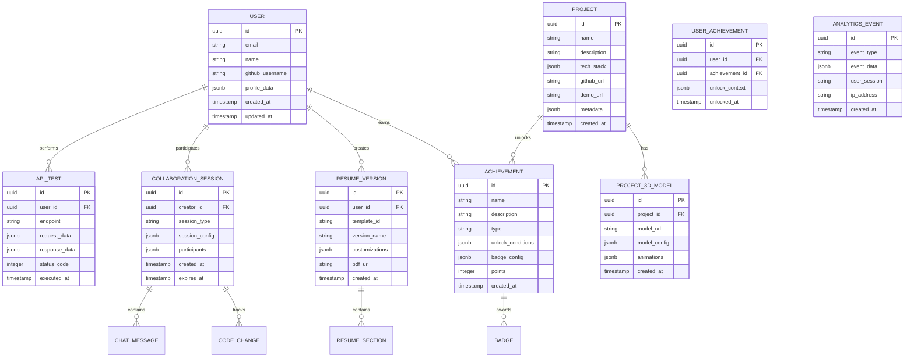

# Advanced Portfolio Features - Technical Architecture Document

## 1. Architecture Design


## 2. Technology Description

- **Frontend**: React@18 + TypeScript@5 + Vite@5 + Three.js@0.160 + Framer Motion@11
- **Backend**: Express@4 + TypeScript@5 + Socket.io@4
- **Database**: Supabase (PostgreSQL) + Redis@7
- **3D Graphics**: Three.js + React Three Fiber + Drei
- **Testing**: Vitest + Playwright + Jest + Testing Library
- **CI/CD**: GitHub Actions + Lighthouse CI + ESLint + Prettier
- **Monitoring**: Sentry + Google Analytics + Custom Dashboard
- **Performance**: Workbox + WebAssembly + GraphQL + Apollo Client
- **Documentation**: Storybook + Swagger + TypeDoc

## 3. Route Definitions

| Route | Purpose |
|-------|---------|
| / | Enhanced homepage with 3D hero section and navigation |
| /3d-showcase | Interactive 3D project visualization and tech stack explorer |
| /collaboration | Live collaboration hub with API testing and code playground |
| /achievements | Gamified achievement system and badge gallery |
| /resume-builder | Dynamic resume generation with customizable templates |
| /playground | Interactive code playground with live execution |
| /api-tester | Advanced API testing interface with authentication |
| /admin | Admin dashboard with analytics and monitoring |
| /docs | Interactive documentation with Swagger UI |
| /storybook | Component library and design system |
| /monitoring | Real-time system monitoring and performance metrics |

## 4. API Definitions

### 4.1 Core APIs

**3D Model Management**
```
GET /api/3d/models
```
Request: None
Response:
| Param Name | Param Type | Description |
|------------|------------|-------------|
| models | Array<3DModel> | List of available 3D models |
| metadata | Object | Model metadata and loading info |

**Achievement System**
```
POST /api/achievements/unlock
```
Request:
| Param Name | Param Type | isRequired | Description |
|------------|------------|------------|-------------|
| userId | string | true | User identifier |
| achievementId | string | true | Achievement to unlock |
| context | Object | false | Additional context data |

Response:
| Param Name | Param Type | Description |
|------------|------------|-------------|
| success | boolean | Unlock status |
| badge | BadgeData | Badge information |
| progress | ProgressData | Updated progress |

**Resume Generation**
```
POST /api/resume/generate
```
Request:
| Param Name | Param Type | isRequired | Description |
|------------|------------|------------|-------------|
| templateId | string | true | Resume template identifier |
| userData | UserProfile | true | User profile data |
| customizations | Object | false | Template customizations |

Response:
| Param Name | Param Type | Description |
|------------|------------|-------------|
| pdfUrl | string | Generated PDF download URL |
| version | string | Resume version identifier |

**Real-time Collaboration**
```
WebSocket /ws/collaboration
```
Events:
- `code-change`: Real-time code editing
- `cursor-move`: Collaborative cursor positions
- `chat-message`: Collaboration chat
- `api-test`: Shared API testing

**Analytics & Monitoring**
```
GET /api/analytics/dashboard
```
Response:
| Param Name | Param Type | Description |
|------------|------------|-------------|
| visitors | AnalyticsData | Visitor statistics |
| performance | PerformanceMetrics | Performance data |
| errors | ErrorLog[] | Recent error logs |
| apiUsage | UsageStats | API usage statistics |

## 5. Server Architecture Diagram


## 6. Data Model

### 6.1 Data Model Definition



### 6.2 Data Definition Language

**Users Table**
```sql
-- Create users table
CREATE TABLE users (
    id UUID PRIMARY KEY DEFAULT gen_random_uuid(),
    email VARCHAR(255) UNIQUE NOT NULL,
    name VARCHAR(100) NOT NULL,
    github_username VARCHAR(100),
    profile_data JSONB DEFAULT '{}',
    created_at TIMESTAMP WITH TIME ZONE DEFAULT NOW(),
    updated_at TIMESTAMP WITH TIME ZONE DEFAULT NOW()
);

-- Enable RLS
ALTER TABLE users ENABLE ROW LEVEL SECURITY;

-- Create policies
CREATE POLICY "Users can view own profile" ON users
    FOR SELECT USING (auth.uid() = id);

CREATE POLICY "Users can update own profile" ON users
    FOR UPDATE USING (auth.uid() = id);
```

**Projects and 3D Models**
```sql
-- Create projects table
CREATE TABLE projects (
    id UUID PRIMARY KEY DEFAULT gen_random_uuid(),
    name VARCHAR(200) NOT NULL,
    description TEXT,
    tech_stack JSONB DEFAULT '[]',
    github_url VARCHAR(500),
    demo_url VARCHAR(500),
    metadata JSONB DEFAULT '{}',
    created_at TIMESTAMP WITH TIME ZONE DEFAULT NOW()
);

-- Create 3D models table
CREATE TABLE project_3d_models (
    id UUID PRIMARY KEY DEFAULT gen_random_uuid(),
    project_id UUID REFERENCES projects(id) ON DELETE CASCADE,
    model_url VARCHAR(500) NOT NULL,
    model_config JSONB DEFAULT '{}',
    animations JSONB DEFAULT '[]',
    created_at TIMESTAMP WITH TIME ZONE DEFAULT NOW()
);

-- Create indexes
CREATE INDEX idx_project_3d_models_project_id ON project_3d_models(project_id);
```

**Achievement System**
```sql
-- Create achievements table
CREATE TABLE achievements (
    id UUID PRIMARY KEY DEFAULT gen_random_uuid(),
    name VARCHAR(200) NOT NULL,
    description TEXT,
    type VARCHAR(50) NOT NULL,
    unlock_conditions JSONB NOT NULL,
    badge_config JSONB DEFAULT '{}',
    points INTEGER DEFAULT 0,
    created_at TIMESTAMP WITH TIME ZONE DEFAULT NOW()
);

-- Create user achievements table
CREATE TABLE user_achievements (
    id UUID PRIMARY KEY DEFAULT gen_random_uuid(),
    user_id UUID REFERENCES users(id) ON DELETE CASCADE,
    achievement_id UUID REFERENCES achievements(id) ON DELETE CASCADE,
    unlock_context JSONB DEFAULT '{}',
    unlocked_at TIMESTAMP WITH TIME ZONE DEFAULT NOW(),
    UNIQUE(user_id, achievement_id)
);

-- Create indexes
CREATE INDEX idx_user_achievements_user_id ON user_achievements(user_id);
CREATE INDEX idx_user_achievements_unlocked_at ON user_achievements(unlocked_at DESC);
```

**Analytics and Monitoring**
```sql
-- Create analytics events table
CREATE TABLE analytics_events (
    id UUID PRIMARY KEY DEFAULT gen_random_uuid(),
    event_type VARCHAR(100) NOT NULL,
    event_data JSONB DEFAULT '{}',
    user_session VARCHAR(100),
    ip_address INET,
    created_at TIMESTAMP WITH TIME ZONE DEFAULT NOW()
);

-- Create partitioned table for performance
CREATE TABLE analytics_events_partitioned (
    LIKE analytics_events INCLUDING ALL
) PARTITION BY RANGE (created_at);

-- Create indexes for analytics
CREATE INDEX idx_analytics_events_type_time ON analytics_events(event_type, created_at DESC);
CREATE INDEX idx_analytics_events_session ON analytics_events(user_session);
```

**Initial Data**
```sql
-- Insert sample achievements
INSERT INTO achievements (name, description, type, unlock_conditions, points) VALUES
('First Visit', 'Welcome to the portfolio!', 'milestone', '{"action": "page_view", "page": "home"}', 10),
('3D Explorer', 'Explored the 3D showcase', 'exploration', '{"action": "3d_interaction", "duration": 30}', 25),
('API Tester', 'Successfully tested an API endpoint', 'technical', '{"action": "api_test", "success": true}', 50),
('Code Collaborator', 'Participated in code collaboration', 'collaboration', '{"action": "collaboration_join"}', 75),
('Resume Builder', 'Generated a custom resume', 'productivity', '{"action": "resume_generate"}', 100);

-- Insert sample projects
INSERT INTO projects (name, description, tech_stack, github_url) VALUES
('3D Portfolio Showcase', 'Interactive 3D portfolio with WebGL', '["Three.js", "React", "TypeScript", "WebGL"]', 'https://github.com/user/3d-portfolio'),
('Real-time Collaboration Tool', 'Live code editing and API testing', '["Socket.io", "Monaco Editor", "Express", "Redis"]', 'https://github.com/user/collaboration-tool'),
('Achievement System', 'Gamified user engagement platform', '["React", "Supabase", "Framer Motion"]', 'https://github.com/user/achievement-system');
```