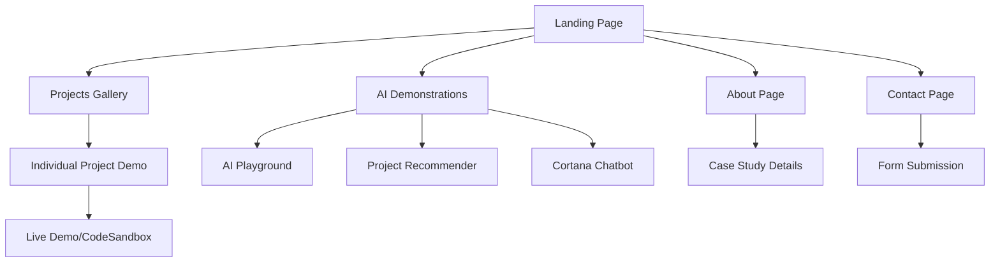

# Hunter & Cortana | Applied AI Solutions Engineering
## Product Requirements Document

## 1. Product Overview

Transform the existing GitHub Pages portfolio into a polished, modern, and fully interactive showcase of AI-enhanced applications and demonstrations under the unified brand identity "Hunter & Cortana | Applied AI Solutions Engineering".

The portfolio will integrate all existing projects into live, interactive demonstrations with professional presentation, modern design principles, and optimized full-stack AI integration capabilities. This transformation targets professional audiences, potential clients, and technical recruiters seeking AI solutions expertise.

## 2. Core Features

### 2.1 User Roles

| Role | Registration Method | Core Permissions |
|------|---------------------|------------------|
| Visitor | No registration required | Can browse all content, interact with demos, use AI playground |
| Professional Contact | Contact form submission | Can submit inquiries, access detailed case studies |

### 2.2 Feature Module

Our AI-enhanced portfolio consists of the following main pages:

1. **Landing Page**: Hero section with animated background, AI-assisted welcome message, flagship projects showcase, navigation menu
2. **Projects Gallery**: Comprehensive project listings with live demos, tech stack badges, AI integration details, filtering and search
3. **AI Demonstrations**: Interactive playground with AI demos (text generation, data visualization, image processing), project recommender quiz
4. **About Page**: Professional bio for Hunter, AI collaboration details with Cortana, expertise highlights, case study deep-dives
5. **Contact Page**: Professional contact form, social media links, GitHub profile integration, inquiry submission system

### 2.3 Page Details

| Page Name | Module Name | Feature Description |
|-----------|-------------|---------------------|
| Landing Page | Hero Section | Animated background with AI-assisted welcome message, brand banner with logo animation |
| Landing Page | Navigation Bar | Persistent navigation with Hunter & Cortana branding, smooth scrolling to sections |
| Landing Page | Flagship Showcase | Highlight 3-5 top projects with descriptions, live preview buttons, and quick access |
| Projects Gallery | Project Grid | Display all projects with filtering by technology, AI integration, and project type |
| Projects Gallery | Project Cards | Individual project cards with title, description, tech stack badges, screenshots, live demo and repo links |
| Projects Gallery | Live Demo Integration | Embedded CodeSandbox/StackBlitz demos, hosted frontend previews |
| AI Demonstrations | AI Playground | Interactive demos for text generation, data visualization, image processing |
| AI Demonstrations | Project Recommender | AI-powered quiz to suggest relevant projects based on user interests |
| AI Demonstrations | Cortana Chatbot | Optional AI guide to help visitors explore the portfolio |
| About Page | Professional Bio | Hunter's background, expertise, personality highlights |
| About Page | Case Studies | Deep-dive analysis of 3-5 flagship projects with problem statements, development process, challenges, solutions |
| About Page | AI Partnership | Details about collaboration with Cortana as AI solutions partner |
| Contact Page | Contact Form | Professional inquiry form with Formspree integration |
| Contact Page | Social Integration | GitHub profile badge, LinkedIn, social media links |
| Contact Page | Response System | Automated acknowledgment and follow-up system |

## 3. Core Process

**Visitor Journey Flow:**
Visitors land on the hero page with animated welcome, explore flagship projects through the showcase section, navigate to detailed project galleries with live demos, interact with AI playground demonstrations, learn about Hunter's expertise in the about section, and submit professional inquiries through the contact form.

**Project Discovery Flow:**
Users can discover projects through the main gallery with filtering options, use the AI-powered project recommender quiz for personalized suggestions, or get guided assistance from the Cortana chatbot for exploration.

## 4. User Interface Design

### 4.1 Design Style

- **Primary Colors**: Hunter Green (#355E3B), Deep Black (#0D1117)
- **Secondary Colors**: Modern neutral accents (#F6F8FA, #21262D, #30363D)
- **Accent Colors**: Electric Blue (#58A6FF) for interactive elements
- **Typography**: 
  - Body text: Inter or similar sleek sans-serif (16px base)
  - Headings: Orbitron or similar futuristic font (24px-48px)
  - Code: JetBrains Mono (14px)
- **Layout Style**: Card-based design with generous whitespace, top navigation bar
- **Animations**: Subtle fade-ins, smooth transitions, animated logo, typewriter effects
- **Icons**: Lucide React icons with consistent 24px sizing
- **Accessibility**: WCAG 2.1 AA compliance, high contrast ratios, keyboard navigation

### 4.2 Page Design Overview

| Page Name | Module Name | UI Elements |
|-----------|-------------|-------------|
| Landing Page | Hero Section | Full-viewport animated background (particles/gradient), centered brand logo with animation, typewriter welcome message, CTA buttons with hover effects |
| Landing Page | Flagship Showcase | 3-column responsive grid, project cards with hover animations, "Try Live Demo" buttons with electric blue accent |
| Projects Gallery | Project Grid | Masonry layout with filtering sidebar, search bar with real-time results, tech stack badges with brand colors |
| AI Demonstrations | Playground Interface | Interactive panels with dark theme, code syntax highlighting, real-time output displays |
| About Page | Bio Section | Split layout with professional photo, timeline component for experience, skills matrix visualization |
| Contact Page | Form Design | Clean form with floating labels, validation states, success/error messaging |

### 4.3 Responsiveness

Desktop-first approach with mobile-adaptive breakpoints at 768px and 1024px. Touch interaction optimization for mobile devices, with swipe gestures for project galleries and optimized button sizing for touch targets.
