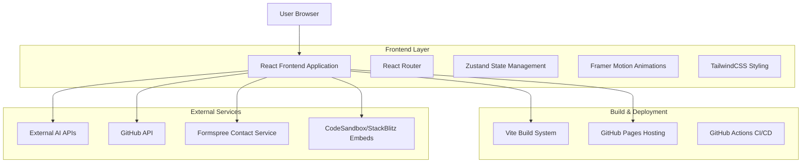
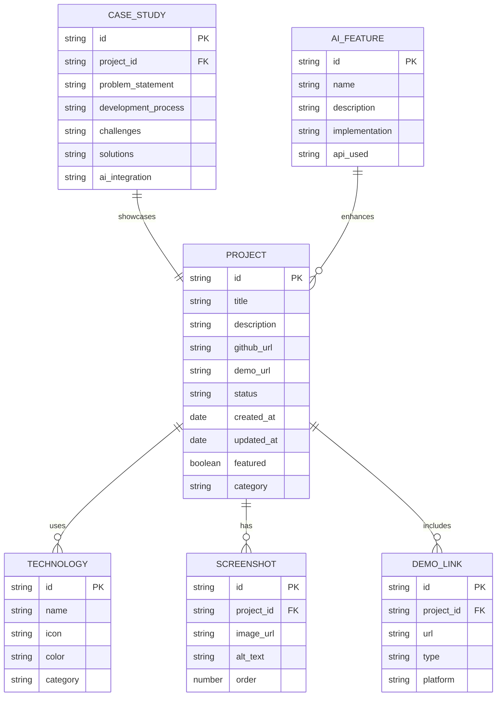

# Hunter & Cortana | Applied AI Solutions Engineering
## Technical Architecture Document

## 1. Architecture Design



## 2. Technology Description

- **Frontend**: React@18 + TypeScript + Vite + TailwindCSS
- **State Management**: Zustand for global state
- **Animations**: Framer Motion for smooth transitions
- **Routing**: React Router DOM v6
- **Icons**: Lucide React
- **Deployment**: GitHub Pages with GitHub Actions
- **External APIs**: GitHub API, OpenAI API (optional), Formspree

## 3. Route Definitions

| Route | Purpose |
|-------|----------|
| / | Landing page with hero section and flagship projects showcase |
| /projects | Complete projects gallery with filtering and search |
| /demonstrations | AI playground and interactive demos |
| /about | Professional bio, case studies, and expertise showcase |
| /contact | Contact form and professional inquiry system |
| /project/:id | Individual project detail pages with live demos |
| /case-study/:id | Detailed case study pages for flagship projects |

## 4. API Definitions

### 4.1 Core APIs

**GitHub Repository Data**
```
GET https://api.github.com/users/straydogsyn/repos
```

Response:
| Param Name | Param Type | Description |
|------------|------------|-------------|
| name | string | Repository name |
| description | string | Project description |
| html_url | string | GitHub repository URL |
| homepage | string | Live demo URL |
| language | string | Primary programming language |
| stargazers_count | number | GitHub stars count |
| updated_at | string | Last update timestamp |

**Contact Form Submission**
```
POST https://formspree.io/f/{form_id}
```

Request:
| Param Name | Param Type | isRequired | Description |
|------------|------------|------------|-------------|
| name | string | true | Contact person name |
| email | string | true | Contact email address |
| subject | string | true | Inquiry subject |
| message | string | true | Detailed message |
| project_interest | string | false | Specific project of interest |

**AI Project Recommender (Future Enhancement)**
```
POST /api/recommend-projects
```

Request:
| Param Name | Param Type | isRequired | Description |
|------------|------------|------------|-------------|
| interests | array | true | User selected interests |
| experience_level | string | true | Technical experience level |
| industry | string | false | Industry preference |

Response:
| Param Name | Param Type | Description |
|------------|------------|-------------|
| recommended_projects | array | List of recommended project IDs |
| confidence_score | number | Recommendation confidence (0-1) |

## 5. Data Model

### 5.1 Data Model Definition



### 5.2 Data Definition Language

**Portfolio Configuration (JSON)**
```json
{
  "branding": {
    "title": "Hunter & Cortana | Applied AI Solutions Engineering",
    "tagline": "Transforming Ideas into Intelligent Solutions",
    "colors": {
      "primary": "#355E3B",
      "secondary": "#0D1117",
      "accent": "#58A6FF"
    }
  },
  "projects": [
    {
      "id": "calculator-react",
      "title": "Advanced Calculator",
      "description": "React-based calculator with memory functions and keyboard support",
      "category": "web-application",
      "technologies": ["React", "TypeScript", "CSS3"],
      "github_url": "https://github.com/straydogsyn/calculator",
      "demo_url": "https://calculator-demo.netlify.app",
      "featured": true,
      "ai_features": [],
      "screenshots": [
        {
          "url": "/assets/screenshots/calculator-main.png",
          "alt": "Calculator main interface"
        }
      ]
    }
  ],
  "case_studies": [
    {
      "id": "flagship-portfolio",
      "project_id": "portfolio-react",
      "problem_statement": "Need for a modern, AI-enhanced portfolio showcase",
      "development_process": "Iterative design and development with user feedback",
      "challenges": "Integrating multiple technologies while maintaining performance",
      "solutions": "Modular architecture with lazy loading and optimized builds",
      "ai_integration": "AI-powered project recommendations and chatbot assistance"
    }
  ]
}
```

**GitHub Integration Script**
```javascript
// Auto-fetch repository data
const fetchGitHubRepos = async () => {
  const response = await fetch('https://api.github.com/users/straydogsyn/repos');
  const repos = await response.json();
  
  return repos.map(repo => ({
    id: repo.name,
    title: repo.name.replace(/-/g, ' ').replace(/\b\w/g, l => l.toUpperCase()),
    description: repo.description || 'No description available',
    github_url: repo.html_url,
    demo_url: repo.homepage,
    language: repo.language,
    stars: repo.stargazers_count,
    updated_at: repo.updated_at
  }));
};
```

**Performance Optimization Configuration**
```javascript
// Vite build optimization
export default defineConfig({
  build: {
    rollupOptions: {
      output: {
        manualChunks: {
          vendor: ['react', 'react-dom'],
          router: ['react-router-dom'],
          animations: ['framer-motion'],
          ui: ['lucide-react']
        }
      }
    },
    chunkSizeWarningLimit: 1000
  },
  optimizeDeps: {
    include: ['react', 'react-dom', 'react-router-dom']
  }
});
```