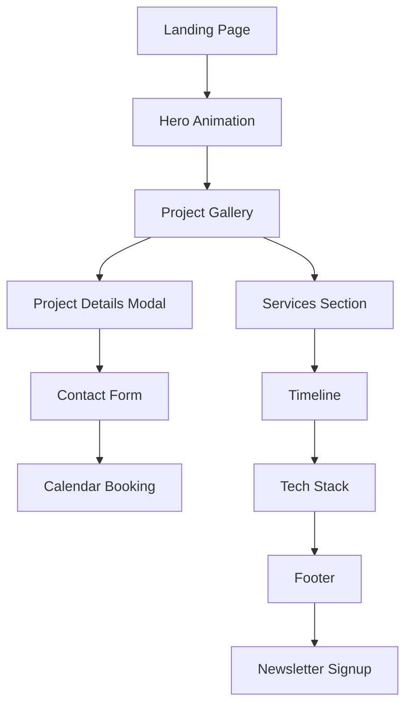

# SOLO Portfolio Optimization Sprint - Product Requirements Document

## 1. Product Overview

Complete overhaul of portfolio website (straydogsyn.github.io/Learner-Files) implementing modern glassmorphic design with performance optimization and enhanced user experience.

The project transforms a basic portfolio into a professional, interactive showcase featuring AI/Web/Tools project categories, real-time GitHub integration, and PWA capabilities. Target: 90+ Lighthouse scores across all metrics with modern design aesthetics.

## 2. Core Features

### 2.1 User Roles

| Role | Registration Method | Core Permissions |
|------|---------------------|------------------|
| Visitor | Direct access | Browse portfolio, view projects, contact form |
| Recruiter | No registration | Access resume, view testimonials, book calendar |
| Client | Contact form | Request services, view case studies, download resources |

### 2.2 Feature Module

Our portfolio optimization consists of the following main phases:

1. **Performance & Structure**: lazy loading, service worker, structured data, critical CSS optimization
2. **Navigation & Hero**: mobile menu, sticky nav, particle animations, typewriter effects, skill badges
3. **Project Showcase**: filterable gallery, 3D flip cards, modal lightbox, GitHub API integration
4. **Interactive Elements**: floating action button, theme toggle, loading skeletons, micro-interactions
5. **Content Sections**: services cards, timeline, blog preview, tech stack, achievements, FAQ
6. **Contact & Footer**: contact form, calendar booking, sitemap, newsletter signup, cookie consent
7. **Advanced Features**: PWA manifest, meta tags, analytics, A/B testing, chatbot widget
8. **Polish & Effects**: glass morphism, shimmer animations, hover effects, parallax scrolling

### 2.3 Page Details

| Page Name | Module Name | Feature description |
|-----------|-------------|---------------------|
| Home | Hero Section | Implement particle.js animation, typewriter effect for tagline, CTA buttons with ripple effects, animated skill badges rotation |
| Home | Navigation | Create sticky nav with blur backdrop, mobile hamburger menu with slide animation, progress indicator bar |
| Home | Project Showcase | Build filterable gallery (AI/Web/Tools), 3D flip cards with details, modal lightbox with image carousel, GitHub API real-time stats |
| Home | Services Section | Display AI Integration/Web Dev/Consulting cards with glassmorphic styling and hover effects |
| Home | Timeline | Create experience/education timeline with scroll-triggered animations and milestone markers |
| Home | Tech Stack | Show animated progress bars for technology proficiency with metallic gradient effects |
| Home | Contact Form | Integrate Formspree/Netlify Forms with validation, calendar booking widget, floating action button |
| Home | Footer | Include sitemap, social links, newsletter signup, back-to-top button, status indicator |
| Projects | Gallery View | Implement filterable project categories, search functionality, pagination, featured project spotlight |
| Projects | Detail Modal | Show project details, image carousel, live demo links, GitHub repository stats, testimonials |
| Blog | Preview Section | Pull from GitHub Pages/Jekyll, show recent posts with excerpts, category tags |
| 404 | Error Page | Create interactive game/animation with brand colors, navigation back to home |

## 3. Core Process

**Visitor Flow:**
User lands on hero section → views animated skill badges → scrolls through project showcase → filters projects by category → opens project details in modal → reads testimonials → contacts via form or calendar booking → downloads resume via floating action button.

**Performance Flow:**
Page load → critical CSS renders immediately → lazy load images on scroll → service worker caches assets → structured data improves SEO → analytics tracks user interactions → A/B testing optimizes conversion.



## 4. User Interface Design

### 4.1 Design Style

- **Primary Colors**: Charcoal (#1C1C1C) background, Hunter Green (#355E3B/#50C878) accents
- **Secondary Colors**: Metallic (#C0C0C0/#D7D7D7) highlights, Glass morphism (rgba(43,43,43,0.15))
- **Typography**: Orbitron for headings with metallic gradient, Inter for body text
- **Button Style**: Glassmorphic with backdrop-filter blur(12px), rounded corners (20px), ripple effects
- **Layout**: Card-based design with sticky navigation, mobile-first responsive breakpoints
- **Icons**: Metallic theme with hover glow effects, animated state transitions

### 4.2 Page Design Overview

| Page Name | Module Name | UI Elements |
|-----------|-------------|-------------|
| Home | Hero Section | Particle.js canvas background, typewriter animation, glassmorphic CTA buttons with ripple effects, animated skill badges carousel |
| Home | Navigation | Sticky nav with backdrop-filter blur, mobile hamburger with slide animation, progress indicator bar, metallic text gradients |
| Home | Project Cards | 3D flip animation on hover, glassmorphic background, GitHub stats badges, category filter buttons with active states |
| Home | Services | Three-column card layout, hover lift effects, metallic icons, glassmorphic styling with border highlights |
| Home | Timeline | Vertical timeline with scroll animations, milestone markers, glassmorphic content cards, progress line |
| Home | Contact Form | Floating action button, form validation states, calendar embed, glassmorphic input fields |
| Projects | Gallery | Masonry layout, filter buttons, search bar, pagination controls, featured project spotlight with video capability |
| Blog | Preview | Card grid layout, excerpt text, category tags, read more buttons, pull from GitHub Pages integration |

### 4.3 Responsiveness

Mobile-first responsive design with breakpoints at 768px (tablet), 1024px (desktop), 1440px (large desktop). Touch interaction optimization for mobile devices with swipe gestures for project carousel and mobile menu. Keyboard navigation support for accessibility compliance.

## 5. Technical Implementation

### 5.1 Performance Optimization
- Lazy loading for all images and assets using Intersection Observer
- Critical CSS inline, defer non-critical styles
- Service worker for offline functionality and caching strategy
- WebP images with fallbacks, optimized SVGs
- Resource hints: preconnect, dns-prefetch
- Bundle and minify CSS/JS assets

### 5.2 SEO & Analytics
- Structured data (JSON-LD): Organization, Person, SoftwareApplication schemas
- Meta tags for social sharing (Open Graph, Twitter cards)
- XML sitemap and robots.txt
- Google Analytics 4 with custom event tracking
- Canonical URLs and breadcrumbs

### 5.3 File Structure
```
/assets/
  /js/main.js
  /css/style.css
  /img/
/data/projects.json
/components/
service-worker.js
manifest.json
CHANGELOG.md
```

### 5.4 Testing Checklist
- [ ] PageSpeed Insights score >90
- [ ] Mobile responsive on all devices
- [ ] Keyboard navigation works
- [ ] Forms submit correctly
- [ ] Animations perform smoothly
- [ ] Links/buttons have hover states
- [ ] Images have alt text
- [ ] Console has no errors
- [ ] Cross-browser compatibility (Chrome, Firefox, Safari, Edge)
- [ ] WCAG 2.1 AA accessibility compliance
- [ ] PWA installability
- [ ] Offline functionality

## 6. Implementation Priorities

1. **Mobile-first responsive design** - Ensure optimal mobile experience
2. **Accessibility compliance** - ARIA labels, focus management, contrast ratios
3. **Performance optimization** - Target 90+ Lighthouse scores
4. **SEO implementation** - Meta descriptions, structured data
5. **Cross-browser compatibility** - Test across all major browsers
6. **Security measures** - CSP headers, HTTPS enforcement, input sanitization

## 7. Development Approach

Deploy changes incrementally, testing each phase before proceeding. Create 'portfolio-v2' branch for development. Document all changes in CHANGELOG.md. Use glassmorphic design system with CSS custom properties for consistent styling across all components.