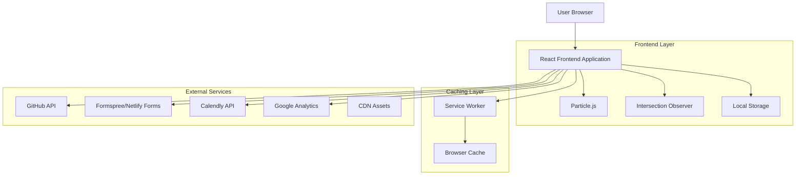
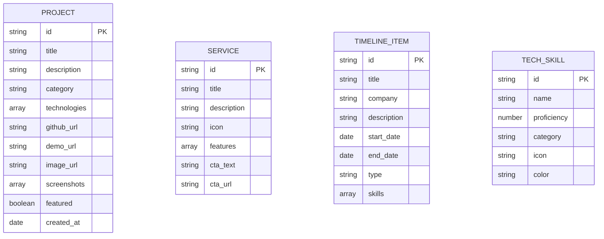
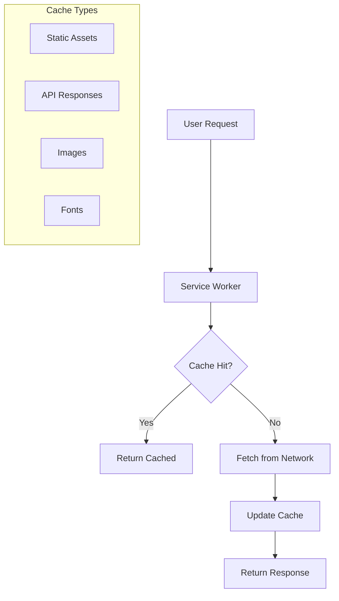

# SOLO Portfolio Optimization Sprint - Technical Architecture Document

## 1. Architecture Design



## 2. Technology Description

- **Frontend**: React@18 + TypeScript + Vite + TailwindCSS@3
- **Animations**: Particle.js + Framer Motion + CSS Animations
- **Performance**: Service Worker + Intersection Observer + Lazy Loading
- **Forms**: Formspree/Netlify Forms integration
- **Analytics**: Google Analytics 4 + Custom Event Tracking
- **PWA**: Web App Manifest + Service Worker
- **Build Tools**: Vite + PostCSS + Autoprefixer

## 3. Route Definitions

| Route | Purpose |
|-------|---------|
| / | Home page with hero, projects, services, timeline, contact |
| /projects | Detailed project gallery with filtering and search |
| /project/:id | Individual project detail page with modal support |
| /blog | Blog preview section pulling from GitHub Pages |
| /services | Detailed services page (AI Integration, Web Dev, Consulting) |
| /contact | Dedicated contact page with form and calendar |
| /resume | Resume download and viewer page |
| /404 | Custom 404 page with interactive elements |

## 4. API Definitions

### 4.1 GitHub API Integration

**Repository Statistics**
```
GET https://api.github.com/repos/{owner}/{repo}
```

Response:
| Param Name | Param Type | Description |
|------------|------------|-------------|
| stargazers_count | number | Number of stars |
| forks_count | number | Number of forks |
| language | string | Primary language |
| updated_at | string | Last update date |

**User Repositories**
```
GET https://api.github.com/users/{username}/repos
```

Response:
| Param Name | Param Type | Description |
|------------|------------|-------------|
| name | string | Repository name |
| description | string | Repository description |
| html_url | string | Repository URL |
| topics | array | Repository topics/tags |

### 4.2 Contact Form API

**Form Submission (Formspree)**
```
POST https://formspree.io/f/{form_id}
```

Request:
| Param Name | Param Type | isRequired | Description |
|------------|------------|------------|-------------|
| name | string | true | Contact name |
| email | string | true | Contact email |
| subject | string | true | Message subject |
| message | string | true | Message content |
| _replyto | string | false | Reply-to email |

Response:
| Param Name | Param Type | Description |
|------------|------------|-------------|
| ok | boolean | Submission status |
| next | string | Redirect URL |

### 4.3 Analytics Events

**Custom Event Tracking**
```javascript
gtag('event', 'action', {
  event_category: 'category',
  event_label: 'label',
  value: 1
});
```

Tracked Events:
- Project card clicks
- Contact form submissions
- Resume downloads
- Theme toggle usage
- Service card interactions

## 5. Data Model

### 5.1 Data Model Definition



### 5.2 Data Definition Language

**Projects Data (projects.json)**
```json
{
  "projects": [
    {
      "id": "ai-chatbot",
      "title": "AI Chatbot Assistant",
      "description": "Intelligent chatbot with natural language processing",
      "category": "AI",
      "technologies": ["React", "Node.js", "OpenAI API", "MongoDB"],
      "github_url": "https://github.com/username/ai-chatbot",
      "demo_url": "https://ai-chatbot-demo.com",
      "image_url": "/assets/img/projects/ai-chatbot.webp",
      "screenshots": ["/assets/img/projects/ai-chatbot-1.webp"],
      "featured": true,
      "created_at": "2024-01-15"
    }
  ]
}
```

**Services Data (services.json)**
```json
{
  "services": [
    {
      "id": "ai-integration",
      "title": "AI Integration",
      "description": "Custom AI solutions for your business",
      "icon": "brain",
      "features": ["Machine Learning", "NLP", "Computer Vision"],
      "cta_text": "Get Started",
      "cta_url": "/contact"
    }
  ]
}
```

**Timeline Data (timeline.json)**
```json
{
  "timeline": [
    {
      "id": "current-role",
      "title": "Senior Developer",
      "company": "Tech Company",
      "description": "Leading AI integration projects",
      "start_date": "2023-01-01",
      "end_date": null,
      "type": "experience",
      "skills": ["React", "Python", "AI/ML"]
    }
  ]
}
```

**Tech Skills Data (skills.json)**
```json
{
  "skills": [
    {
      "id": "react",
      "name": "React",
      "proficiency": 90,
      "category": "Frontend",
      "icon": "react-icon",
      "color": "#61DAFB"
    }
  ]
}
```

## 6. Performance Architecture

### 6.1 Caching Strategy



### 6.2 Loading Strategy

- **Critical CSS**: Inline above-the-fold styles
- **Lazy Loading**: Images and non-critical components
- **Code Splitting**: Route-based chunks
- **Preloading**: Critical resources and fonts
- **Intersection Observer**: Trigger animations and lazy loading

## 7. Security & Compliance

### 7.1 Content Security Policy
```
Content-Security-Policy: 
  default-src 'self';
  script-src 'self' 'unsafe-inline' https://www.googletagmanager.com;
  style-src 'self' 'unsafe-inline' https://fonts.googleapis.com;
  img-src 'self' data: https:;
  connect-src 'self' https://api.github.com https://formspree.io;
```

### 7.2 Privacy & GDPR
- Cookie consent banner
- Analytics opt-out mechanism
- Data processing transparency
- User data deletion requests

## 8. Deployment & Monitoring

### 8.1 Build Process
```bash
# Development
npm run dev

# Production Build
npm run build
npm run preview

# Deploy
npm run deploy
```

### 8.2 Performance Monitoring
- Lighthouse CI integration
- Core Web Vitals tracking
- Error boundary implementation
- Performance budget enforcement
- Real User Monitoring (RUM)

### 8.3 A/B Testing Framework
```javascript
// A/B Test Configuration
const abTest = {
  testId: 'cta-button-color',
  variants: {
    A: { color: '#355E3B' },
    B: { color: '#50C878' }
  },
  traffic: 0.5
};
```