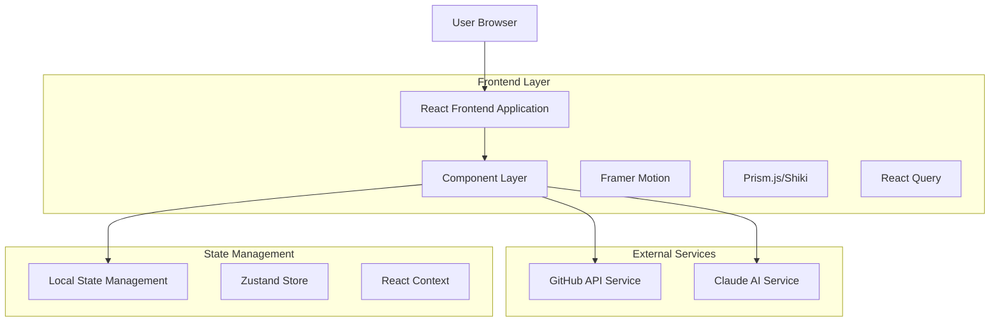

# Interactive Portfolio Components - Technical Architecture Document

## 1. Architecture Design



## 2. Technology Description

- **Frontend**: React@18 + TypeScript@5 + Vite@5
- **Styling**: TailwindCSS@3 + Framer Motion@11
- **State Management**: Zustand@4 + React Query@5
- **Code Highlighting**: Shiki@1 (preferred) or Prism.js@1.29
- **Icons**: Lucide React@0.400
- **HTTP Client**: Axios@1.6
- **Testing**: Vitest@1 + React Testing Library@14

## 3. Route Definitions

| Route | Purpose |
|-------|---------|
| /portfolio | Main portfolio page with all interactive components |
| /portfolio/projects | Dedicated project showcase page |
| /portfolio/skills | Skills visualization page |
| /portfolio/experience | Experience timeline page |
| /portfolio/code | Code showcase gallery |
| /portfolio/activity | GitHub activity dashboard |

## 4. API Definitions

### 4.1 GitHub API Integration

**Repository Information**
```typescript
GET https://api.github.com/repos/{owner}/{repo}
```

Response:
| Param Name | Param Type | Description |
|------------|------------|-------------|
| stargazers_count | number | Repository star count |
| updated_at | string | Last update timestamp |
| language | string | Primary programming language |
| topics | string[] | Repository topics/tags |

**User Activity**
```typescript
GET https://api.github.com/users/{username}/events
```

Response:
| Param Name | Param Type | Description |
|------------|------------|-------------|
| type | string | Event type (PushEvent, PullRequestEvent, etc.) |
| created_at | string | Event timestamp |
| repo | object | Repository information |
| payload | object | Event-specific data |

### 4.2 Claude AI Integration

**Skill Description Generation**
```typescript
POST /api/ai/generate-skill-description
```

Request:
| Param Name | Param Type | isRequired | Description |
|------------|------------|------------|-------------|
| skill | string | true | Skill name |
| experience_level | string | true | Proficiency level |
| context | string | false | Additional context |

Response:
| Param Name | Param Type | Description |
|------------|------------|-------------|
| description | string | Generated skill description |
| examples | string[] | Usage examples |

**Code Explanation**
```typescript
POST /api/ai/explain-code
```

Request:
| Param Name | Param Type | isRequired | Description |
|------------|------------|------------|-------------|
| code | string | true | Code snippet |
| language | string | true | Programming language |
| complexity | string | false | Explanation complexity level |

Response:
| Param Name | Param Type | Description |
|------------|------------|-------------|
| explanation | string | Code explanation |
| key_concepts | string[] | Important concepts |
| suggestions | string[] | Improvement suggestions |

## 5. Component Architecture

### 5.1 Component Hierarchy

```mermaid
graph TD
    A[PortfolioApp] --> B[FilterableProjectGrid]
    A --> C[InteractiveSkillsChart]
    A --> D[CodeShowcase]
    A --> E[ExperienceTimeline]
    A --> F[GitHubActivityFeed]
    
    B --> B1[ProjectCard]
    B --> B2[FilterBar]
    B --> B3[SearchInput]
    B --> B4[ProjectModal]
    
    C --> C1[SkillCategory]
    C --> C2[SkillProgressBar]
    C --> C3[SkillDetailPanel]
    C --> C4[RadarChart]
    
    D --> D1[CodeBlock]
    D --> D2[LanguageSelector]
    D --> D3[CodeExecutor]
    D --> D4[ExplanationPanel]
    
    E --> E1[TimelineEntry]
    E --> E2[TimelineFilter]
    E --> E3[MediaViewer]
    E --> E4[EntryModal]
    
    F --> F1[ActivityItem]
    F --> F2[ContributionGraph]
    F --> F3[RepoStats]
    F --> F4[ActivityFilter]
```



### 5.2 State Management Structure

```typescript
// Portfolio Store (Zustand)
interface PortfolioStore {
  // Projects
  projects: Project[];
  filteredProjects: Project[];
  selectedTechnologies: string[];
  searchQuery: string;
  
  // Skills
  skills: SkillCategory[];
  selectedSkill: Skill | null;
  skillDescriptions: Record<string, string>;
  
  // Experience
  experiences: Experience[];
  selectedExperienceType: string;
  
  // GitHub
  githubActivity: GitHubEvent[];
  repositories: Repository[];
  
  // Actions
  setProjects: (projects: Project[]) => void;
  filterProjects: (technologies: string[], query: string) => void;
  selectSkill: (skill: Skill) => void;
  fetchGitHubData: () => Promise<void>;
}
```

## 6. Data Models

### 6.1 Core Data Types

```typescript
interface Project {
  id: string;
  title: string;
  description: string;
  longDescription?: string;
  technologies: string[];
  githubUrl: string;
  liveUrl?: string;
  imageUrl: string;
  featured: boolean;
  starCount?: number;
  lastUpdated?: string;
}

interface Skill {
  id: string;
  name: string;
  category: 'Frontend' | 'Backend' | 'AI/ML' | 'DevOps';
  proficiency: number; // 0-100
  yearsOfExperience: number;
  description?: string;
  projects: string[]; // Project IDs
}

interface Experience {
  id: string;
  title: string;
  company: string;
  type: 'work' | 'project' | 'achievement';
  startDate: string;
  endDate?: string;
  description: string;
  technologies: string[];
  media?: MediaItem[];
}

interface GitHubEvent {
  id: string;
  type: string;
  repo: {
    name: string;
    url: string;
  };
  created_at: string;
  payload: any;
}

interface CodeSnippet {
  id: string;
  title: string;
  language: string;
  code: string;
  description: string;
  executable: boolean;
  tags: string[];
}
```

### 6.2 Performance Optimization

**Lazy Loading Implementation**
```typescript
// Virtual scrolling for large project lists
const ProjectGrid = () => {
  const { data, fetchNextPage, hasNextPage } = useInfiniteQuery({
    queryKey: ['projects'],
    queryFn: ({ pageParam = 0 }) => fetchProjects(pageParam),
    getNextPageParam: (lastPage, pages) => lastPage.nextCursor,
  });
  
  return (
    <VirtualizedGrid
      items={data?.pages.flat() || []}
      renderItem={ProjectCard}
      threshold={0.8}
      onLoadMore={fetchNextPage}
    />
  );
};
```

**Memoization Strategy**
```typescript
// Expensive computations memoized
const filteredProjects = useMemo(() => {
  return projects.filter(project => 
    selectedTechnologies.every(tech => 
      project.technologies.includes(tech)
    ) && 
    project.title.toLowerCase().includes(searchQuery.toLowerCase())
  );
}, [projects, selectedTechnologies, searchQuery]);
```

### 6.3 Accessibility Implementation

**ARIA Labels and Keyboard Navigation**
```typescript
const ProjectCard = ({ project }: { project: Project }) => {
  return (
    <div
      role="article"
      aria-labelledby={`project-title-${project.id}`}
      tabIndex={0}
      onKeyDown={(e) => {
        if (e.key === 'Enter' || e.key === ' ') {
          openProjectModal(project);
        }
      }}
    >
      <h3 id={`project-title-${project.id}`}>{project.title}</h3>
      <p aria-describedby={`project-desc-${project.id}`}>
        {project.description}
      </p>
      <div role="list" aria-label="Technologies used">
        {project.technologies.map(tech => (
          <span key={tech} role="listitem" aria-label={`Technology: ${tech}`}>
            {tech}
          </span>
        ))}
      </div>
    </div>
  );
};
```

### 6.4 Animation Configuration

**Framer Motion Variants**
```typescript
const cardVariants = {
  hidden: { opacity: 0, y: 20 },
  visible: { 
    opacity: 1, 
    y: 0,
    transition: { duration: 0.3, ease: 'easeOut' }
  },
  hover: {
    y: -8,
    boxShadow: '0 20px 40px rgba(0,0,0,0.1)',
    transition: { duration: 0.2 }
  }
};

const staggerContainer = {
  hidden: { opacity: 0 },
  visible: {
    opacity: 1,
    transition: {
      staggerChildren: 0.1,
      delayChildren: 0.2
    }
  }
};
```

### 6.5 Error Handling and Loading States

**Comprehensive Error Boundaries**
```typescript
const ComponentErrorBoundary = ({ children }: { children: React.ReactNode }) => {
  return (
    <ErrorBoundary
      fallback={<ErrorFallback />}
      onError={(error, errorInfo) => {
        console.error('Component error:', error, errorInfo);
        // Send to error tracking service
      }}
    >
      {children}
    </ErrorBoundary>
  );
};
```

**Loading State Management**
```typescript
const useAsyncState = <T>(asyncFn: () => Promise<T>) => {
  const [state, setState] = useState<{
    data: T | null;
    loading: boolean;
    error: Error | null;
  }>({ data: null, loading: true, error: null });
  
  useEffect(() => {
    asyncFn()
      .then(data => setState({ data, loading: false, error: null }))
      .catch(error => setState({ data: null, loading: false, error }));
  }, []);
  
  return state;
};
```