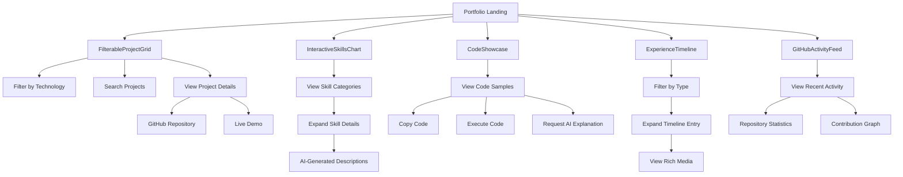

# Interactive Portfolio Components - Product Requirements Document

## 1. Product Overview

A comprehensive suite of interactive React components designed to showcase professional portfolio content with advanced features including real-time filtering, GitHub API integration, animations, and accessibility compliance. The components provide an engaging user experience while maintaining optimal performance through lazy loading and efficient state management.

## 2. Core Features

### 2.1 Feature Module

Our interactive portfolio requirements consist of the following main components:

1. **FilterableProjectGrid**: Dynamic project showcase with filtering, search, and GitHub integration
2. **InteractiveSkillsChart**: Visual skills representation with expandable details and AI integration
3. **CodeShowcase**: Syntax-highlighted code display with execution and explanation features
4. **ExperienceTimeline**: Interactive timeline for work history and achievements
5. **GitHubActivityFeed**: Real-time GitHub activity visualization

### 2.2 Component Details

| Component Name | Module Name | Feature Description |
|----------------|-------------|--------------------|
| FilterableProjectGrid | Project Cards | Display project thumbnails with hover animations, tech stack badges, GitHub/demo links, expandable descriptions |
| FilterableProjectGrid | Filtering System | Real-time filtering by technology stack, search functionality, category-based organization |
| FilterableProjectGrid | GitHub Integration | Fetch and display star count, last update date, repository statistics via GitHub API |
| FilterableProjectGrid | Performance | Lazy loading implementation, smooth animations with Framer Motion |
| InteractiveSkillsChart | Skills Visualization | Categorized skills display (Frontend, Backend, AI/ML, DevOps) with animated progress bars or radar chart |
| InteractiveSkillsChart | Interaction System | Click-to-expand skill details, proficiency level indicators |
| InteractiveSkillsChart | AI Integration | Claude 4.1 integration points for dynamic skill descriptions |
| CodeShowcase | Syntax Highlighting | Multi-language code display using Prism.js or Shiki |
| CodeShowcase | Interactive Features | Copy-to-clipboard functionality, live JavaScript/TypeScript execution |
| CodeShowcase | AI Enhancement | Claude 4.1 integration for on-demand code explanations |
| ExperienceTimeline | Timeline Display | Chronological work experience, projects, and achievements visualization |
| ExperienceTimeline | Filtering & Animation | Type-based filtering, smooth scroll animations, expandable entries |
| ExperienceTimeline | Rich Media | Support for images, videos, and interactive content within timeline entries |
| GitHubActivityFeed | Activity Display | Recent commits, pull requests, repository statistics |
| GitHubActivityFeed | Visualization | Contribution graph, activity timeline, repository metrics |
| GitHubActivityFeed | Real-time Updates | Live data fetching and display of GitHub activity |

## 3. Core Process

### User Interaction Flow

1. **Portfolio Browsing**: Users land on portfolio and interact with FilterableProjectGrid to explore projects
2. **Project Discovery**: Users filter projects by technology, search for specific content, and view detailed project information
3. **Skills Exploration**: Users interact with InteractiveSkillsChart to understand technical proficiencies and experience levels
4. **Code Review**: Users examine CodeShowcase components to see code quality and request AI explanations
5. **Experience Timeline**: Users navigate through professional history using the interactive timeline
6. **GitHub Activity**: Users view real-time development activity through the GitHub feed

## 4. User Interface Design

### 4.1 Design Style

- **Primary Colors**: Modern gradient scheme with #3B82F6 (blue) and #8B5CF6 (purple)
- **Secondary Colors**: Neutral grays (#F8FAFC, #64748B) for backgrounds and text
- **Button Style**: Rounded corners (8px), subtle shadows, hover state animations
- **Typography**: Inter font family, 16px base size, clear hierarchy with 1.5 line height
- **Layout Style**: Card-based design with consistent spacing (16px, 24px, 32px grid)
- **Animation Style**: Smooth transitions (300ms ease-in-out), subtle hover effects, loading states
- **Icon Style**: Lucide React icons for consistency, 20px standard size

### 4.2 Component Design Overview

| Component Name | Module Name | UI Elements |
|----------------|-------------|-------------|
| FilterableProjectGrid | Filter Bar | Horizontal scrollable tech stack chips, search input with icon, clear filters button |
| FilterableProjectGrid | Project Cards | 3-column grid (responsive), hover lift effect, thumbnail with overlay, badge collection |
| FilterableProjectGrid | Loading States | Skeleton cards, shimmer effects, progressive loading indicators |
| InteractiveSkillsChart | Skill Categories | Tabbed interface, color-coded categories, animated transitions |
| InteractiveSkillsChart | Progress Visualization | Animated progress bars or radar chart, percentage indicators, skill level labels |
| InteractiveSkillsChart | Detail Panels | Expandable cards, smooth slide animations, AI-generated content areas |
| CodeShowcase | Code Display | Dark theme syntax highlighting, line numbers, language indicators |
| CodeShowcase | Action Bar | Copy button, execute button, explain button, language selector |
| CodeShowcase | Output Panel | Console-style output display, error handling, execution status |
| ExperienceTimeline | Timeline Structure | Vertical timeline with connecting lines, milestone markers, date labels |
| ExperienceTimeline | Entry Cards | Expandable content cards, rich media containers, tag systems |
| ExperienceTimeline | Filter Controls | Dropdown selectors, toggle switches, active filter indicators |
| GitHubActivityFeed | Activity List | Chronological feed layout, commit message truncation, repository links |
| GitHubActivityFeed | Statistics Panel | Metric cards, contribution heatmap, repository showcase |
| GitHubActivityFeed | Real-time Indicators | Live update badges, refresh controls, last updated timestamps |

### 4.3 Responsiveness

Desktop-first approach with mobile-adaptive breakpoints:
- **Desktop**: Full feature set, multi-column layouts, hover interactions
- **Tablet**: Adjusted grid layouts, touch-optimized interactions, simplified navigation
- **Mobile**: Single-column layouts, swipe gestures, collapsible sections, touch-friendly buttons
- **Accessibility**: ARIA labels, keyboard navigation, screen reader support, high contrast mode compatibility