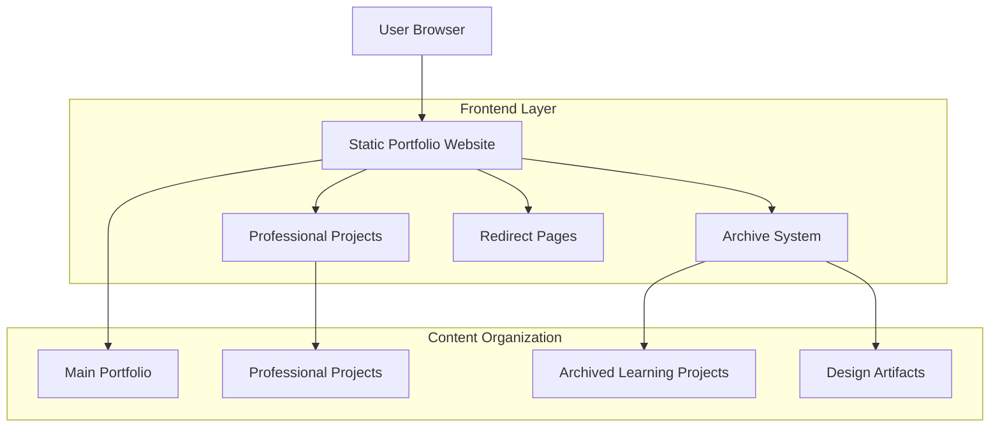

# Portfolio Transformation - Technical Architecture Document

## 1. Architecture Design



## 2. Technology Description

* Frontend: HTML5 + CSS3 + Vanilla JavaScript + Tailwind CSS

* Build Tools: Node.js + npm (existing package.json structure)

* Deployment: Static hosting (GitHub Pages compatible)

* Analytics: Google Analytics integration for redirect tracking

## 3. Route Definitions

| Route                       | Purpose                                                      |
| --------------------------- | ------------------------------------------------------------ |
| /index.html                 | Main portfolio landing page showcasing professional projects |
| /projects.html              | Professional projects overview and navigation                |
| /bio.html                   | Professional biography and technical skills                  |
| /contacts.html              | Professional contact information and opportunities           |
| /projects/knucklebones/     | Featured professional game application                       |
| /projects/quiz-ninja2.1/    | Featured educational application                             |
| /projects/calculator.html   | Redirect page for archived calculator project                |
| /projects/circle-maker.html | Redirect page for archived circle-maker project              |
| /projects/compTIA.html      | Redirect page for archived compTIA project                   |
| /projects/countdown.html    | Redirect page for archived countdown project                 |
| /projects/navbar.html       | Redirect page for archived navbar project                    |
| /projects/noid.html         | Redirect page for archived noid project                      |
| /projects/rps.html          | Redirect page for archived rps project                       |
| /projects/toDoList.html     | Redirect page for archived toDoList project                  |

## 4. File Structure Transformation

### 4.1 Current Structure

```
Learner-Files-1/
├── projects/
│   ├── calculator/
│   ├── circle-maker/
│   ├── compTIA/
│   ├── countdown/
│   ├── knucklebones/          # Keep - Professional
│   ├── navbar/
│   ├── noid/
│   ├── quiz-ninja2.1/         # Keep - Professional
│   ├── rps/
│   └── toDoList/
├── assets/
├── css/
├── js/
└── [other files]
```

### 4.2 Target Structure

```
Learner-Files-1/
├── projects/
│   ├── knucklebones/          # Professional Project
│   ├── quiz-ninja2.1/         # Professional Project
│   ├── calculator.html        # Redirect Page
│   ├── circle-maker.html      # Redirect Page
│   ├── compTIA.html           # Redirect Page
│   ├── countdown.html         # Redirect Page
│   ├── navbar.html            # Redirect Page
│   ├── noid.html              # Redirect Page
│   ├── rps.html               # Redirect Page
│   └── toDoList.html          # Redirect Page
├── archive/
│   ├── learning-projects/
│   │   ├── calculator/
│   │   ├── circle-maker/
│   │   ├── compTIA/
│   │   ├── countdown/
│   │   ├── navbar/
│   │   ├── noid/
│   │   ├── rps/
│   │   └── toDoList/
│   ├── design-artifacts/
│   │   ├── lowFi/
│   │   └── legacy-screenshots/
│   └── legacy-pages/
│       └── resume/
├── backup-YYYYMMDD/           # Automated backup
├── assets/
├── css/
├── js/
└── [other files]
```

## 5. Implementation Scripts

### 5.1 Automation Script Adaptation

The provided bash script needs modification for the current structure:

**Key Changes Required:**

* Change `public/projects/` references to `projects/`

* Update redirect page paths to match current structure

* Ensure Windows compatibility for file operations

* Add validation for existing professional projects

### 5.2 Redirect Page Template

**Standard Redirect Page Structure:**

```html
<!DOCTYPE html>
<html lang="en">
<head>
    <meta charset="UTF-8">
    <meta name="viewport" content="width=device-width, initial-scale=1.0">
    <title>[PROJECT] - Portfolio Archive | StrayDog Syndications</title>
    <meta name="description" content="This project has been archived as part of our portfolio modernization. View our current professional projects.">
    <meta http-equiv="refresh" content="5;url=../index.html">
    <link rel="canonical" href="../index.html">
    <!-- Glassmorphism styling with professional branding -->
</head>
<body>
    <!-- Professional redirect message with CTA -->
    <!-- Analytics tracking for redirect events -->
</body>
</html>
```

## 6. Content Management Strategy

### 6.1 Professional Project Enhancement

**knucklebones Project:**

* Highlight advanced game logic and strategic gameplay

* Showcase interactive UI design and user experience

* Emphasize technical implementation details

**quiz-ninja2.1 Project:**

* Feature educational application design

* Demonstrate data management capabilities

* Highlight user interaction and feedback systems

### 6.2 Archive Organization

**Learning Projects Archive:**

* Preserve all learning projects for reference

* Maintain original functionality and code

* Document learning progression and skill development

**Design Artifacts Archive:**

* Organize lowFi designs and prototypes

* Preserve legacy screenshots and documentation

* Maintain design evolution history

## 7. SEO and Analytics Implementation

### 7.1 Redirect Page SEO

* Meta descriptions emphasizing portfolio evolution

* Canonical URLs pointing to main portfolio

* Structured data for professional projects

* Google Analytics event tracking for redirects

### 7.2 Professional Project SEO

* Optimized meta descriptions highlighting technical skills

* Open Graph tags for social media sharing

* Technical keyword optimization

* Performance optimization for fast loading

## 8. Deployment Considerations

### 8.1 Static Hosting Compatibility

* All files remain static HTML/CSS/JS

* No server-side dependencies

* GitHub Pages deployment ready

* CDN optimization for global performance

### 8.2 Backup and Recovery

* Automated backup creation before transformation

* Version control integration

* Rollback capability for safe deployment

* Archive preservation for future reference

## 9. Performance Optimization

### 9.1 Asset Optimization

* Image compression for faster loading

* CSS/JS minification for production

* Lazy loading for non-critical content

* Progressive enhancement for mobile devices

### 9.2 User Experience

* Fast redirect page loading (< 2 seconds)

* Smooth animations and transitions

* Mobile-responsive design

* Accessibility compliance (WCAG 2.1)

## 10. Maintenance and Updates

### 10.1 Content Updates

* Easy addition of new professional projects

* Archive system scalability

* Documentation for future modifications

* Analytics monitoring for user behavior

### 10.2 Technical Maintenance

* Regular dependency updates

* Performance monitoring

* SEO optimization reviews

* Security best practices implementation

