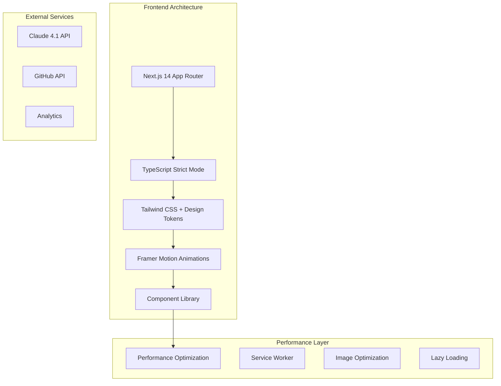

# 🚀 Complete Portfolio Transformation Architecture
## Next.js 14 Industry-Leading Showcase Implementation

### 1. Mission Overview

**Objective**: Transform basic GitHub Pages portfolio into industry-leading showcase with Next.js 14 App Router architecture, advanced design systems, and professional functionality.

**Complexity Level**: Maximum
**Expected Duration**: 8-12 hours continuous operation
**Performance Target**: 95+ Lighthouse scores across all categories

### 2. Technical Architecture

#### 2.1 Core Technology Stack



#### 2.2 Technology Specifications

| Component | Technology | Version | Purpose |
|-----------|------------|---------|----------|
| Framework | Next.js | 14.x | App Router architecture, SSG/SSR |
| Language | TypeScript | 5.x | Strict type safety |
| Styling | Tailwind CSS | 3.x | Utility-first CSS framework |
| Animations | Framer Motion | 10.x | Physics-based animations |
| Icons | Lucide React | Latest | Consistent icon system |
| Fonts | Google Fonts | - | Playfair Display, Inter, JetBrains Mono |
| State | React Context | - | Global state management |
| Forms | React Hook Form | 7.x | Form validation and handling |

### 3. Component Architecture

#### 3.1 Atomic Design System

```text
src/
├── components/
│   ├── atoms/                  # Basic building blocks
│   │   ├── Button/
│   │   ├── Input/
│   │   ├── Typography/
│   │   └── Icon/
│   ├── molecules/              # Simple component combinations
│   │   ├── SearchBox/
│   │   ├── ProjectCard/
│   │   └── SkillBadge/
│   ├── organisms/              # Complex component groups
│   │   ├── Navigation/
│   │   ├── ProjectGrid/
│   │   ├── ContactForm/
│   │   └── AIChat/
│   ├── templates/              # Page-level layouts
│   │   ├── MainLayout/
│   │   ├── ProjectLayout/
│   │   └── BlogLayout/
│   └── pages/                  # Complete page components
│       ├── HomePage/
│       ├── ProjectsPage/
│       └── ContactPage/
├── hooks/                      # Custom React hooks
├── utils/                      # Utility functions
├── types/                      # TypeScript definitions
├── styles/                     # Global styles and tokens
└── lib/                        # External service integrations
```

#### 3.2 Design Token System

```typescript
// Design tokens configuration
export const designTokens = {
  colors: {
    primary: {
      50: '#f0f9ff',
      500: '#0F172A',  // Deep navy
      900: '#0c1220'
    },
    secondary: {
      50: '#fffbeb',
      500: '#F59E0B',  // Vibrant amber
      900: '#92400e'
    },
    accent: {
      500: '#3B82F6'   // Electric blue
    }
  },
  spacing: {
    xs: '8px',
    sm: '16px',
    md: '24px',
    lg: '32px',
    xl: '48px',
    '2xl': '64px',
    '3xl': '96px'
  },
  typography: {
    fontFamily: {
      display: ['Playfair Display', 'serif'],
      body: ['Inter', 'sans-serif'],
      mono: ['JetBrains Mono', 'monospace']
    },
    fontSize: {
      xs: '12px',
      sm: '14px',
      base: '16px',
      lg: '18px',
      xl: '20px',
      '2xl': '24px',
      '3xl': '30px',
      '4xl': '36px',
      '5xl': '48px',
      '6xl': '64px'
    }
  }
}
```

### 4. Performance Architecture

#### 4.1 Performance Optimization Strategy

| Optimization | Implementation | Target Metric |
|--------------|----------------|---------------|
| Code Splitting | Dynamic imports, route-based splitting | Reduce initial bundle size |
| Image Optimization | Next.js Image component, WebP/AVIF | LCP < 2.5s |
| Lazy Loading | Intersection Observer API | Improve initial load |
| Service Worker | Workbox integration | Offline functionality |
| CDN Integration | Cloudflare configuration | Global content delivery |
| Bundle Analysis | webpack-bundle-analyzer | Monitor bundle size |

#### 4.2 Lighthouse Performance Targets

```yaml
Performance Metrics:
  First Contentful Paint: < 1.5s
  Largest Contentful Paint: < 2.5s
  Cumulative Layout Shift: < 0.1
  Time to Interactive: < 3s
  Total Blocking Time: < 300ms
  
Accessibility:
  WCAG 2.1 AA Compliance: 100%
  Keyboard Navigation: Full support
  Screen Reader: Optimized
  
Best Practices:
  HTTPS: Required
  Security Headers: Implemented
  Modern Image Formats: WebP/AVIF
  
SEO:
  Meta Tags: Optimized
  Structured Data: JSON-LD
  Open Graph: Complete
```

### 5. Advanced Features Architecture

#### 5.1 AI-Powered Portfolio Chat

```typescript
// AI Chat integration architecture
interface ChatMessage {
  id: string
  role: 'user' | 'assistant'
  content: string
  timestamp: Date
}

interface ChatContext {
  portfolioData: PortfolioData
  projectDetails: ProjectDetail[]
  skillsMatrix: SkillsMatrix
}

class PortfolioAI {
  private claude: ClaudeAPI
  private context: ChatContext
  
  async generateResponse(message: string): Promise<string> {
    // Claude 4.1 API integration
    // Context-aware responses about portfolio
  }
}
```

#### 5.2 Interactive Project Filtering

```typescript
// Advanced filtering system
interface ProjectFilter {
  categories: string[]
  technologies: string[]
  complexity: 'beginner' | 'intermediate' | 'advanced'
  dateRange: [Date, Date]
  searchQuery: string
}

interface ProjectMetadata {
  id: string
  title: string
  description: string
  technologies: Technology[]
  category: ProjectCategory
  complexity: ComplexityLevel
  featured: boolean
  metrics: ProjectMetrics
}
```

### 6. Design System Implementation

#### 6.1 Glassmorphism Design Language

```css
/* Advanced glassmorphism utilities */
.glass-card {
  background: rgba(255, 255, 255, 0.1);
  backdrop-filter: blur(20px);
  border: 1px solid rgba(255, 255, 255, 0.2);
  border-radius: 16px;
  box-shadow: 
    0 8px 32px rgba(0, 0, 0, 0.1),
    inset 0 1px 0 rgba(255, 255, 255, 0.2);
}

.glass-navigation {
  background: rgba(15, 23, 42, 0.8);
  backdrop-filter: blur(24px) saturate(180%);
  border-bottom: 1px solid rgba(255, 255, 255, 0.1);
}
```

#### 6.2 Dark/Light Mode System

```typescript
// Theme system implementation
interface ThemeConfig {
  mode: 'light' | 'dark' | 'system'
  colors: ColorPalette
  animations: AnimationConfig
}

const useTheme = () => {
  const [theme, setTheme] = useState<ThemeConfig>()
  
  const toggleTheme = () => {
    // Smooth transition implementation
    // System preference detection
    // Local storage persistence
  }
  
  return { theme, toggleTheme }
}
```

### 7. Deployment Architecture

#### 7.1 CI/CD Pipeline

```yaml
# GitHub Actions workflow
name: Portfolio Deployment
on:
  push:
    branches: [main]
    
jobs:
  build-and-deploy:
    runs-on: ubuntu-latest
    steps:
      - name: Checkout
        uses: actions/checkout@v4
        
      - name: Setup Node.js
        uses: actions/setup-node@v4
        with:
          node-version: '18'
          
      - name: Install dependencies
        run: npm ci
        
      - name: Run tests
        run: npm test
        
      - name: Lighthouse CI
        run: npm run lighthouse
        
      - name: Build
        run: npm run build
        
      - name: Deploy to GitHub Pages
        uses: peaceiris/actions-gh-pages@v3
        with:
          github_token: ${{ secrets.GITHUB_TOKEN }}
          publish_dir: ./out
```

#### 7.2 Monitoring and Analytics

```typescript
// Performance monitoring setup
interface PerformanceMetrics {
  fcp: number
  lcp: number
  cls: number
  fid: number
  ttfb: number
}

class PerformanceMonitor {
  private analytics: AnalyticsService
  
  trackWebVitals(metrics: PerformanceMetrics) {
    // Real-time performance tracking
    // Error boundary monitoring
    // User interaction analytics
  }
}
```

### 8. Security and Accessibility

#### 8.1 Security Implementation

- **Content Security Policy**: Strict CSP headers
- **HTTPS Enforcement**: Redirect all HTTP to HTTPS
- **API Security**: Rate limiting and authentication
- **Data Validation**: Input sanitization and validation

#### 8.2 Accessibility Features

- **Keyboard Navigation**: Full keyboard accessibility
- **Screen Reader Support**: ARIA labels and descriptions
- **Color Contrast**: WCAG AA compliant contrast ratios
- **Focus Management**: Visible focus indicators
- **Reduced Motion**: Respect user preferences

### 9. Content Strategy

#### 9.1 SEO Optimization

```typescript
// SEO metadata configuration
interface SEOConfig {
  title: string
  description: string
  keywords: string[]
  openGraph: OpenGraphData
  structuredData: StructuredData
}

const seoConfig: SEOConfig = {
  title: "Professional Web Developer Portfolio | [Name]",
  description: "Industry-leading web development portfolio showcasing modern React, TypeScript, and Next.js projects with advanced performance optimization.",
  keywords: ["web developer", "react", "typescript", "nextjs", "portfolio"]
}
```

#### 9.2 Content Architecture

- **Project Case Studies**: Problem-solution-result framework
- **Technical Blog**: Development insights and tutorials
- **Skills Showcase**: Interactive competency matrix
- **Testimonials**: Client feedback and recommendations
- **Contact Integration**: Multi-step contact wizard

### 10. Success Metrics

#### 10.1 Performance KPIs

| Metric | Target | Measurement |
|--------|--------|--------------|
| Lighthouse Performance | 95+ | Automated CI testing |
| Page Load Time | < 2s | Real User Monitoring |
| Bounce Rate | < 30% | Google Analytics |
| Conversion Rate | > 5% | Contact form submissions |
| Mobile Performance | 90+ | Mobile Lighthouse scores |

#### 10.2 Business Objectives

- **Portfolio Views**: 500+ unique visitors/month
- **Project Inquiries**: 10+ qualified leads/month
- **Technical Recognition**: Industry blog features
- **Network Growth**: 100+ professional connections
- **Career Advancement**: Senior developer opportunities

This architecture provides a comprehensive foundation for transforming the portfolio into an industry-leading showcase with modern technology, advanced design systems, and professional functionality.