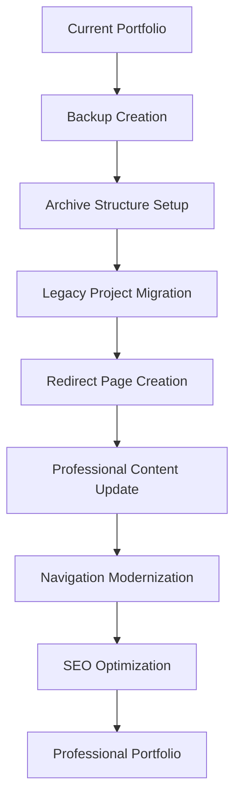

# Portfolio Transformation - Product Requirements Document

## 1. Product Overview

Transform StrayDog Syndications portfolio from a learning-focused showcase to a professional-grade portfolio that highlights advanced technical skills and real-world impact. The transformation will archive legacy tutorial projects while elevating professional applications to demonstrate career readiness and technical expertise.

The project addresses the need to present a cohesive, professional image to potential employers and clients by strategically organizing content and implementing modern web standards with SEO optimization.

## 2. Core Features

### 2.1 User Roles

| Role            | Registration Method | Core Permissions                                                                        |
| --------------- | ------------------- | --------------------------------------------------------------------------------------- |
| Visitor         | Direct access       | Can browse portfolio, view professional projects, access archived content via redirects |
| Portfolio Owner | Direct access       | Can manage content, update projects, monitor analytics                                  |

### 2.2 Feature Module

Our portfolio transformation consists of the following main components:

1. **Archive System**: Legacy project organization, redirect management, SEO preservation.
2. **Professional Portfolio**: Modernized layout, featured projects showcase, enhanced navigation.
3. **Project Showcase**: Professional project highlighting, detailed case studies, technical demonstrations.
4. **Navigation Structure**: Streamlined menu system, improved user experience, mobile optimization.

### 2.3 Page Details

| Page Name              | Module Name              | Feature description                                                                                                               |
| ---------------------- | ------------------------ | --------------------------------------------------------------------------------------------------------------------------------- |
| Archive System         | Legacy Project Archive   | Move learning projects (calculator, circle-maker, compTIA, countdown, navbar, noid, rps, toDoList) to organized archive structure |
| Archive System         | SEO Redirect Pages       | Create professional redirect pages with 5-second auto-redirect, analytics tracking, and portfolio evolution messaging             |
| Archive System         | Design Artifacts Archive | Organize lowFi designs, legacy screenshots, and development artifacts for reference                                               |
| Professional Portfolio | Main Landing Page        | Modernized index.html with professional branding, featured projects, and clear value proposition                                  |
| Professional Portfolio | Projects Showcase        | Highlight knucklebones and quiz-ninja2.1 as professional-grade applications with detailed descriptions                            |
| Professional Portfolio | About Section            | Enhanced bio.html with professional focus, technical skills, and career objectives                                                |
| Navigation Structure   | Menu System              | Streamlined navigation focusing on professional content, archived project access                                                  |
| Navigation Structure   | Contact Integration      | Professional contact page with clear call-to-action for opportunities                                                             |

## 3. Core Process

**Portfolio Transformation Flow:**

1. **Backup Creation**: Automated backup of current state before any modifications
2. **Archive Organization**: Create structured archive directories for different content types
3. **Legacy Project Migration**: Move learning projects to archive with redirect page creation
4. **Professional Content Enhancement**: Update main portfolio pages to highlight professional projects
5. **Navigation Modernization**: Implement streamlined navigation focusing on career-relevant content
6. **SEO Optimization**: Ensure all redirects maintain search engine visibility and user experience



## 4. User Interface Design

### 4.1 Design Style

* **Primary Colors**: Professional blue (#667eea), accent amber (#f59e0b)

* **Secondary Colors**: Deep purple (#764ba2), clean whites and grays

* **Button Style**: Modern rounded buttons with hover animations and gradient backgrounds

* **Typography**: Inter font family for professional readability, varied sizes for hierarchy

* **Layout Style**: Clean card-based design with glassmorphism effects, top navigation with mobile responsiveness

* **Visual Elements**: Subtle gradients, backdrop blur effects, professional iconography

### 4.2 Page Design Overview

| Page Name              | Module Name                 | UI Elements                                                                                                                                             |
| ---------------------- | --------------------------- | ------------------------------------------------------------------------------------------------------------------------------------------------------- |
| Archive Redirect Pages | Portfolio Evolution Message | Glassmorphism container with gradient background (#667eea to #764ba2), centered layout, professional typography, animated CTA button with hover effects |
| Professional Portfolio | Main Showcase               | Hero section with professional branding, featured project cards with hover animations, clean navigation bar, responsive grid layout                     |
| Project Details        | Professional Applications   | Detailed project cards highlighting knucklebones and quiz-ninja2.1, technical stack displays, live demo links, GitHub integration                       |
| Navigation             | Menu System                 | Streamlined top navigation, mobile hamburger menu, professional color scheme, clear hierarchy                                                           |

### 4.3 Responsiveness

Desktop-first approach with mobile-adaptive design, touch interaction optimization for mobile devices, and responsive breakpoints ensuring professional presentation across all screen sizes.

## 5. Technical Implementation Notes

### 5.1 Archive Structure

```
archive/
├── learning-projects/
│   ├── calculator/
│   ├── circle-maker/
│   ├── compTIA/
│   ├── countdown/
│   ├── navbar/
│   ├── noid/
│   ├── rps/
│   └── toDoList/
├── design-artifacts/
│   ├── lowFi/
│   └── legacy-screenshots/
└── legacy-pages/
    └── resume/
```

### 5.2 Professional Projects Focus

* **knucklebones**: Advanced game logic, interactive UI, strategic gameplay

* **quiz-ninja2.1**: Educational application, data management, user interaction

### 5.3 SEO Considerations

* Redirect pages maintain search engine indexing

* Professional project pages optimized for discovery

* Meta descriptions emphasize technical skills and professional readiness

* Canonical URLs point to main portfolio sections

