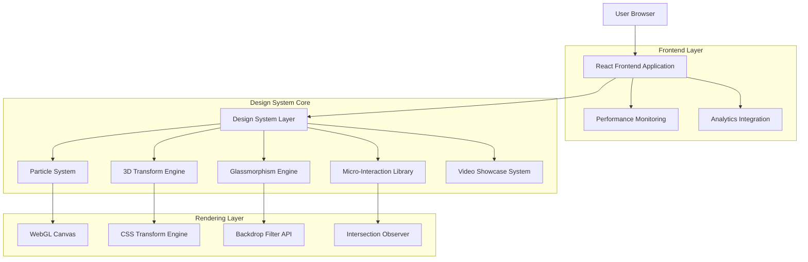
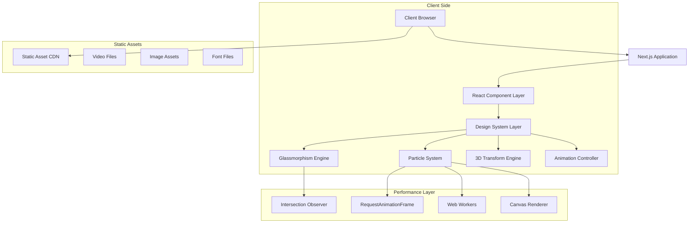
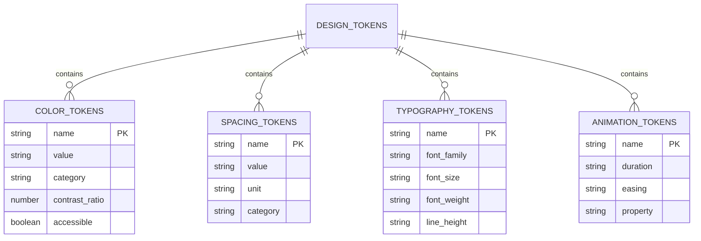
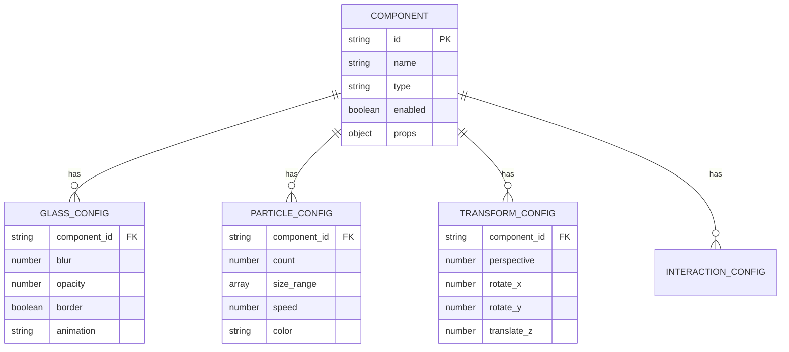

# Visual Design System - Technical Architecture Document

## 1. Architecture Design



## 2. Technology Description

- Frontend: React@18 + TypeScript + Next.js@15 + Tailwind CSS@3 + Framer Motion@11
- Animation: Framer Motion + CSS Transforms + WebGL + Canvas API
- Styling: Tailwind CSS + CSS Custom Properties + PostCSS
- Performance: Intersection Observer API + RequestAnimationFrame + Web Workers
- Build: Vite + ESBuild + CSS Optimization + Tree Shaking

## 3. Component Architecture

### 3.1 Design System Structure

| Component Layer | Purpose | Examples |
|----------------|---------|----------|
| Atoms | Basic building blocks with glassmorphism | GlassButton, GlassCard, ParticleBackground |
| Molecules | Combined atoms with interactions | ProjectCard, VideoPlayer, ContactForm |
| Organisms | Complex UI sections | Hero, Navigation, ProjectGrid |
| Templates | Page layouts with design system | MainLayout, ProjectLayout |
| Pages | Complete pages with all features | Home, Projects, CaseStudies, Contact |

### 3.2 Core Design Utilities

| Utility | Purpose | Implementation |
|---------|---------|----------------|
| GlassmorphismEngine | Advanced backdrop-blur effects | CSS backdrop-filter + custom properties |
| ParticleSystem | Interactive background animations | WebGL + Canvas API + Physics engine |
| TransformEngine | 3D CSS transforms and animations | CSS transforms + Intersection Observer |
| MicroInteractions | Hover states and micro-animations | Framer Motion + CSS transitions |
| GradientSystem | Dynamic gradient generation | CSS custom properties + JavaScript |

## 4. API Definitions

### 4.1 Glassmorphism Engine API

**GlassEffect Configuration**
```typescript
interface GlassConfig {
  blur: number;           // Backdrop blur intensity (8-30px)
  opacity: number;        // Background opacity (0.05-0.2)
  border: boolean;        // Enable border highlight
  borderOpacity: number;  // Border opacity (0.1-0.3)
  gradient: boolean;      // Enable gradient overlay
  shadow: boolean;        // Enable drop shadow
  animation: 'none' | 'float' | 'pulse' | 'glow' | 'shimmer';
  intensity: 'subtle' | 'medium' | 'strong';
}
```

**Usage Example:**
```typescript
const glassCard = useGlassEffect({
  blur: 20,
  opacity: 0.1,
  border: true,
  borderOpacity: 0.2,
  gradient: true,
  shadow: true,
  animation: 'float',
  intensity: 'medium'
});
```

### 4.2 Particle System API

**Particle Configuration**
```typescript
interface ParticleConfig {
  count: number;          // Number of particles (50-200)
  size: [number, number]; // Min/max particle size
  speed: number;          // Movement speed (0.1-2.0)
  color: string;          // Particle color (hex/rgba)
  opacity: [number, number]; // Min/max opacity
  interactive: boolean;   // Mouse interaction enabled
  physics: {
    gravity: number;      // Gravity effect (0-1)
    friction: number;     // Movement friction (0.9-0.99)
    attraction: number;   // Mouse attraction force
  };
}
```

**Usage Example:**
```typescript
const particles = useParticleSystem({
  count: 100,
  size: [2, 6],
  speed: 0.5,
  color: '#3B82F6',
  opacity: [0.3, 0.8],
  interactive: true,
  physics: {
    gravity: 0.1,
    friction: 0.95,
    attraction: 0.3
  }
});
```

### 4.3 3D Transform Engine API

**Transform Configuration**
```typescript
interface Transform3DConfig {
  perspective: number;    // Perspective distance (500-2000px)
  rotateX: number;       // X-axis rotation (-180 to 180)
  rotateY: number;       // Y-axis rotation (-180 to 180)
  rotateZ: number;       // Z-axis rotation (-180 to 180)
  translateZ: number;    // Z-axis translation (-100 to 100px)
  scale: number;         // Scale factor (0.5-2.0)
  duration: number;      // Animation duration (ms)
  easing: string;        // CSS easing function
}
```

**Usage Example:**
```typescript
const transform3D = useTransform3D({
  perspective: 1000,
  rotateY: 15,
  translateZ: 20,
  scale: 1.02,
  duration: 300,
  easing: 'cubic-bezier(0.4, 0, 0.2, 1)'
});
```

### 4.4 Micro-Interaction API

**Interaction Configuration**
```typescript
interface MicroInteractionConfig {
  trigger: 'hover' | 'focus' | 'click' | 'scroll';
  effect: 'scale' | 'glow' | 'lift' | 'blur' | 'color';
  intensity: 'subtle' | 'medium' | 'strong';
  duration: number;      // Animation duration (ms)
  delay: number;         // Animation delay (ms)
  easing: string;        // CSS easing function
}
```

**Usage Example:**
```typescript
const microInteraction = useMicroInteraction({
  trigger: 'hover',
  effect: 'glow',
  intensity: 'medium',
  duration: 200,
  delay: 0,
  easing: 'ease-out'
});
```

### 4.5 Video Showcase API

**Video Player Configuration**
```typescript
interface VideoConfig {
  src: string;           // Video source URL
  poster: string;        // Poster image URL
  chapters: Chapter[];   // Chapter navigation
  controls: {
    play: boolean;       // Show play/pause button
    volume: boolean;     // Show volume control
    progress: boolean;   // Show progress bar
    fullscreen: boolean; // Show fullscreen button
    quality: boolean;    // Show quality selector
    speed: boolean;      // Show playback speed
  };
  autoplay: boolean;     // Auto-play video
  loop: boolean;         // Loop video
  muted: boolean;        // Start muted
}
```

## 5. Server Architecture Diagram



## 6. Data Model

### 6.1 Design Token System



### 6.2 Component Configuration Schema



## 7. Implementation Details

### 7.1 CSS Custom Properties System

```css
:root {
  /* Color Psychology Palette */
  --color-navy-primary: #0F172A;
  --color-navy-secondary: #1E293B;
  --color-amber-primary: #F59E0B;
  --color-amber-secondary: #D97706;
  
  /* Glassmorphism Properties */
  --glass-blur-subtle: 8px;
  --glass-blur-medium: 16px;
  --glass-blur-strong: 24px;
  --glass-opacity-subtle: 0.05;
  --glass-opacity-medium: 0.1;
  --glass-opacity-strong: 0.15;
  
  /* Animation Properties */
  --animation-fast: 150ms;
  --animation-medium: 300ms;
  --animation-slow: 500ms;
  --easing-smooth: cubic-bezier(0.4, 0, 0.2, 1);
  --easing-bounce: cubic-bezier(0.68, -0.55, 0.265, 1.55);
  
  /* 3D Transform Properties */
  --perspective-close: 500px;
  --perspective-medium: 1000px;
  --perspective-far: 2000px;
}
```

### 7.2 Performance Optimization Strategies

**CSS Optimization:**
```css
/* Hardware acceleration triggers */
.gpu-accelerated {
  transform: translateZ(0);
  will-change: transform;
}

/* Containment for complex effects */
.glass-container {
  contain: layout style paint;
}

/* Reduced motion support */
@media (prefers-reduced-motion: reduce) {
  .animated {
    animation: none;
    transition: none;
  }
}
```

**JavaScript Performance:**
```typescript
// Intersection Observer for scroll animations
const useScrollAnimation = () => {
  const observer = new IntersectionObserver(
    (entries) => {
      entries.forEach(entry => {
        if (entry.isIntersecting) {
          entry.target.classList.add('animate-in');
        }
      });
    },
    { threshold: 0.1, rootMargin: '50px' }
  );
};

// RequestAnimationFrame for smooth animations
const useAnimationFrame = (callback: () => void) => {
  const animate = () => {
    callback();
    requestAnimationFrame(animate);
  };
  requestAnimationFrame(animate);
};
```

### 7.3 Accessibility Implementation

**Motion Preferences:**
```typescript
const useReducedMotion = () => {
  const [prefersReducedMotion, setPrefersReducedMotion] = useState(false);
  
  useEffect(() => {
    const mediaQuery = window.matchMedia('(prefers-reduced-motion: reduce)');
    setPrefersReducedMotion(mediaQuery.matches);
    
    const handleChange = () => setPrefersReducedMotion(mediaQuery.matches);
    mediaQuery.addEventListener('change', handleChange);
    
    return () => mediaQuery.removeEventListener('change', handleChange);
  }, []);
  
  return prefersReducedMotion;
};
```

**Focus Management:**
```css
/* Enhanced focus indicators */
.focus-visible {
  outline: 2px solid var(--color-amber-primary);
  outline-offset: 2px;
  box-shadow: 0 0 0 4px rgba(245, 158, 11, 0.2);
}

/* Skip to content link */
.skip-link {
  position: absolute;
  top: -40px;
  left: 6px;
  background: var(--color-navy-primary);
  color: white;
  padding: 8px;
  text-decoration: none;
  transition: top 0.3s;
}

.skip-link:focus {
  top: 6px;
}
```

### 7.4 Cross-Browser Compatibility

**Backdrop Filter Fallbacks:**
```css
.glass-effect {
  background: rgba(255, 255, 255, 0.1);
  
  /* Modern browsers */
  backdrop-filter: blur(20px);
  -webkit-backdrop-filter: blur(20px);
  
  /* Fallback for unsupported browsers */
  @supports not (backdrop-filter: blur(20px)) {
    background: rgba(255, 255, 255, 0.2);
    border: 1px solid rgba(255, 255, 255, 0.3);
  }
}
```

**WebGL Fallbacks:**
```typescript
const useWebGLSupport = () => {
  const [isSupported, setIsSupported] = useState(false);
  
  useEffect(() => {
    const canvas = document.createElement('canvas');
    const gl = canvas.getContext('webgl') || canvas.getContext('experimental-webgl');
    setIsSupported(!!gl);
  }, []);
  
  return isSupported;
};
```

## 8. Testing Strategy

### 8.1 Performance Testing
- Lighthouse audits for Core Web Vitals
- Frame rate monitoring for animations
- Memory usage profiling for particle systems
- Bundle size analysis for code splitting

### 8.2 Visual Regression Testing
- Screenshot comparison across browsers
- Animation timing verification
- Responsive design validation
- Accessibility compliance testing

### 8.3 User Experience Testing
- Interaction responsiveness measurement
- Animation smoothness evaluation
- Loading performance assessment
- Cross-device compatibility verification

This technical architecture provides a comprehensive foundation for implementing the cutting-edge visual design system while maintaining performance, accessibility, and cross-browser compatibility.