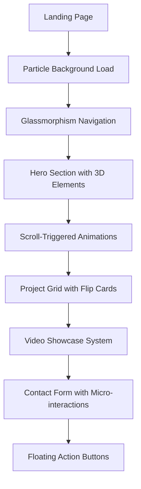

# Cutting-Edge Visual Design System - Product Requirements Document

## 1. Product Overview

This document outlines the implementation of an industry-leading visual design system for the portfolio website, featuring advanced glassmorphism effects, dynamic gradient systems, micro-interactions, particle systems, 3D CSS transforms, and a professional navy/amber color palette. The system positions the portfolio as a cutting-edge showcase of modern web development capabilities while maintaining professional aesthetics and optimal user experience.

The design system will establish visual hierarchy through sophisticated glass effects, create engaging user interactions through micro-animations, and provide a cohesive brand identity that reflects expertise in AI and justice reform themes.

## 2. Core Features

### 2.1 User Roles

| Role | Registration Method | Core Permissions |
|------|---------------------|------------------|
| Visitor | No registration required | Can browse portfolio, interact with animations, view projects |
| Recruiter | Email contact form | Can access detailed case studies, download resume, schedule meetings |
| Client | Contact wizard | Can view full project details, access video showcases, request consultations |

### 2.2 Feature Module

Our cutting-edge visual design system consists of the following main components:

1. **Glassmorphism Effects Library**: Advanced backdrop-blur effects, dynamic opacity controls, gradient overlays, micro-interaction states.
2. **Dynamic Gradient System**: CSS custom properties for real-time gradient manipulation, color psychology-based themes, responsive gradient scaling.
3. **Micro-Interaction Library**: Hover states, loading animations, button morphing, cursor effects, scroll-triggered animations.
4. **Particle Systems**: Interactive background particles, mouse-following effects, performance-optimized canvas animations.
5. **3D CSS Transform Engine**: Depth layering, perspective effects, card flip animations, floating elements.
6. **Professional Color Palette**: Navy/amber theme system, accessibility-compliant contrast ratios, semantic color tokens.
7. **Video Showcase System**: Custom player controls, chapter navigation, quality selection, fullscreen mode.
8. **Animation Framework**: Viewport intersection observers, smooth scroll effects, progressive loading animations.
9. **Interactive Components**: Project cards with reveal effects, floating action buttons, morphing navigation.
10. **Brand Identity System**: Custom iconography, typography hierarchy, visual language guidelines.

### 2.3 Page Details

| Page Name | Module Name | Feature description |
|-----------|-------------|---------------------|
| Home | Hero Section | Implement particle background system, 3D floating elements, dynamic gradient overlays, glassmorphism navigation bar |
| Home | Skills Showcase | Create interactive skill badges with hover animations, progress bars with gradient fills, micro-interaction feedback |
| Projects | Project Grid | Design flip animation cards, reveal effects on hover, glassmorphism overlays, 3D transform depth |
| Projects | Filter System | Build morphing filter buttons, smooth transitions, dynamic background patterns |
| Case Studies | Detail View | Implement video showcase with custom controls, chapter navigation, progressive image loading |
| Case Studies | Interactive Elements | Create floating action buttons, scroll-triggered animations, parallax effects |
| Contact | Contact Form | Design glassmorphism form fields, micro-interaction validation, morphing submit button |
| Contact | Background Effects | Implement responsive particle system, dynamic gradient backgrounds |
| About | Profile Section | Create professional photography display, custom iconography, brand identity elements |
| About | Timeline | Build interactive timeline with 3D transforms, hover states, smooth scroll animations |

## 3. Core Process

### Main User Flow

Users begin their journey on the homepage where they encounter an immersive particle background system with floating 3D elements. The glassmorphism navigation bar provides smooth transitions between sections. As users scroll, viewport intersection observers trigger smooth animations that reveal content progressively.

When exploring projects, users interact with flip animation cards that reveal detailed information on hover. The filter system uses morphing buttons with dynamic background patterns that respond to user selections. Video showcases feature custom player controls with chapter navigation and quality selection.

The contact process utilizes glassmorphism form fields with micro-interaction validation feedback. Floating action buttons provide quick access to key actions throughout the site. All interactions are enhanced with particle effects and 3D transforms that create depth and engagement.

## 4. User Interface Design

### 4.1 Design Style

**Primary Colors:**
- Navy Primary: #0F172A (Professional depth)
- Navy Secondary: #1E293B (Subtle contrast)
- Amber Accent: #F59E0B (Energy and innovation)
- Amber Secondary: #D97706 (Warm highlights)

**Button Style:**
- Glassmorphism with backdrop-blur effects
- Rounded corners (12px-20px radius)
- Gradient borders and hover states
- Morphing animations on interaction

**Typography:**
- Display Font: Playfair Display (Elegant headers)
- Body Font: Inter (Clean readability)
- Mono Font: JetBrains Mono (Code snippets)
- Font sizes: 14px-72px with fluid scaling

**Layout Style:**
- Card-based design with glassmorphism effects
- Floating navigation with backdrop-blur
- Grid systems with 3D transform depth
- Particle background overlays

**Animation Style:**
- Smooth 300ms transitions
- Easing functions: cubic-bezier curves
- Particle systems with 60fps performance
- Micro-interactions with haptic feedback simulation

### 4.2 Page Design Overview

| Page Name | Module Name | UI Elements |
|-----------|-------------|-------------|
| Home | Hero Section | Particle canvas background (#0F172A), floating 3D cards with glassmorphism (backdrop-blur: 20px), gradient text overlays, morphing CTA buttons |
| Home | Navigation | Glassmorphism navbar (rgba(15,23,42,0.8)), backdrop-blur: 24px, border-bottom: 1px solid rgba(255,255,255,0.1) |
| Projects | Project Cards | Flip animation containers, glassmorphism overlays, 3D transform: rotateY(180deg), hover scale: 1.02 |
| Projects | Filter System | Morphing buttons with gradient backgrounds, dynamic particle trails, smooth state transitions |
| Case Studies | Video Player | Custom controls with glassmorphism styling, chapter navigation sidebar, quality selector dropdown |
| Contact | Form Fields | Glassmorphism inputs (backdrop-blur: 16px), floating labels, micro-interaction validation states |
| About | Profile Display | Professional photography with consistent styling, custom AI/justice reform iconography |

### 4.3 Responsiveness

The design system is mobile-first with adaptive glassmorphism effects that scale based on device capabilities. Touch interactions are optimized with larger hit targets and haptic feedback simulation. Particle systems automatically reduce complexity on mobile devices to maintain 60fps performance. All 3D transforms include fallbacks for devices with limited GPU capabilities.

## 5. Technical Implementation

### 5.1 Glassmorphism System

**Advanced Backdrop-Blur Effects:**
- Multi-layer blur combinations
- Dynamic opacity based on scroll position
- Gradient overlay systems
- Border highlight effects

**Performance Optimizations:**
- CSS containment for blur regions
- Hardware acceleration triggers
- Reduced motion preferences support
- Progressive enhancement approach

### 5.2 Particle System Architecture

**Canvas-Based Implementation:**
- WebGL acceleration when available
- Fallback to 2D canvas
- Mouse interaction physics
- Performance monitoring and adaptive quality

**Interaction Features:**
- Mouse-following particle trails
- Click explosion effects
- Scroll-based particle density
- Color theme synchronization

### 5.3 3D Transform Engine

**CSS Transform Optimizations:**
- Hardware-accelerated transforms
- Perspective calculations
- Z-index management system
- Intersection observer triggers

**Animation Choreography:**
- Staggered entrance animations
- Parallax scrolling effects
- Hover state transformations
- Exit transition sequences

### 5.4 Micro-Interaction Library

**Hover State System:**
- Scale transformations (1.02-1.05)
- Glow effects with box-shadow
- Color transition animations
- Cursor morphing effects

**Loading Animation Framework:**
- Skeleton screens with shimmer effects
- Progressive image loading with blur-up
- Spinner animations with brand colors
- Progress indicators with gradient fills

### 5.5 Video Showcase Implementation

**Custom Player Controls:**
- Glassmorphism control bar
- Chapter navigation system
- Quality selection dropdown
- Fullscreen mode with custom UI

**Advanced Features:**
- Thumbnail preview on hover
- Keyboard navigation support
- Analytics integration
- Social sharing capabilities

## 6. Brand Identity Guidelines

### 6.1 Visual Language

**Core Principles:**
- Professional sophistication through navy palette
- Innovation energy through amber accents
- Technical expertise through glassmorphism effects
- Accessibility through high contrast ratios

**Iconography System:**
- AI-themed icons: neural networks, algorithms, data flows
- Justice reform icons: scales, gavels, reform symbols
- Technical icons: code brackets, servers, databases
- Consistent stroke width and corner radius

### 6.2 Photography Standards

**Professional Headshots:**
- Consistent lighting and background
- High-resolution formats (minimum 2x retina)
- Progressive JPEG with WebP fallbacks
- Blur-up loading implementation

**Project Screenshots:**
- Standardized device mockups
- Consistent shadow and reflection effects
- Optimized file sizes with quality preservation
- Lazy loading with intersection observers

### 6.3 Social Media Assets

**Platform Specifications:**
- LinkedIn: 1200x627px cover images
- Twitter: 1500x500px header images
- GitHub: 1280x640px repository cards
- Portfolio: 1920x1080px hero images

**Design Consistency:**
- Brand color palette integration
- Typography hierarchy maintenance
- Logo placement guidelines
- Call-to-action button styling

## 7. Performance Considerations

### 7.1 Optimization Strategies

**CSS Performance:**
- Critical CSS inlining
- Non-critical CSS lazy loading
- CSS containment for complex effects
- GPU acceleration triggers

**JavaScript Optimization:**
- Code splitting for animation libraries
- Intersection observer for scroll effects
- RequestAnimationFrame for smooth animations
- Web Workers for particle calculations

### 7.2 Accessibility Compliance

**Motion Preferences:**
- Respect prefers-reduced-motion
- Alternative static designs
- Focus indicator enhancements
- Screen reader compatibility

**Color Accessibility:**
- WCAG AA contrast ratios
- Color-blind friendly palettes
- High contrast mode support
- Focus state visibility

## 8. Implementation Timeline

### Phase 1: Foundation (Week 1-2)
- Glassmorphism utility library
- Color system implementation
- Typography hierarchy setup
- Basic micro-interactions

### Phase 2: Advanced Effects (Week 3-4)
- Particle system development
- 3D transform engine
- Video showcase system
- Animation framework

### Phase 3: Integration (Week 5-6)
- Component integration
- Performance optimization
- Accessibility testing
- Cross-browser compatibility

### Phase 4: Polish (Week 7-8)
- Brand identity finalization
- Social media assets
- Documentation completion
- User testing and refinement

## 9. Success Metrics

### 9.1 Performance Targets
- Lighthouse Performance Score: 95+
- First Contentful Paint: <1.5s
- Largest Contentful Paint: <2.5s
- Cumulative Layout Shift: <0.1

### 9.2 User Engagement
- Average session duration: >3 minutes
- Bounce rate: <30%
- Video completion rate: >70%
- Contact form conversion: >5%

### 9.3 Technical Excellence
- Cross-browser compatibility: 99%
- Mobile responsiveness: 100%
- Accessibility score: AA compliance
- Code quality: A+ grade

This cutting-edge visual design system will position the portfolio as an industry-leading showcase of modern web development capabilities while maintaining professional aesthetics and optimal user experience.