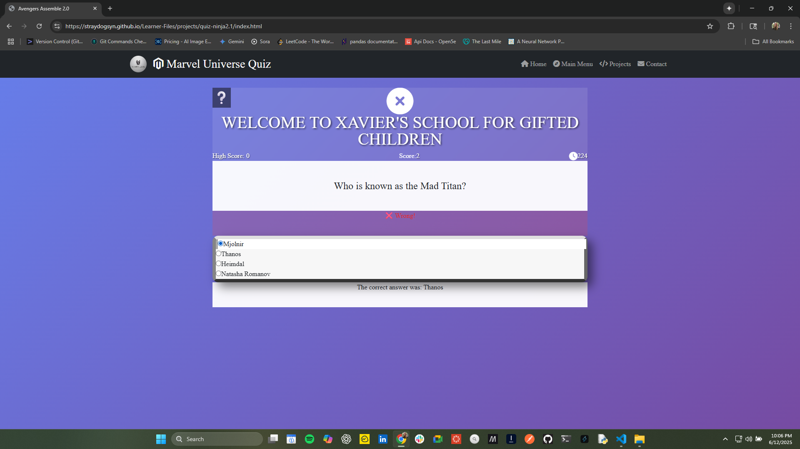

# Professional Web Development Portfolio 

## 🌐 Live Portfolio

**View the portfolio online:** [https://straydogsyn.github.io/Learner-Files](https://straydogsyn.github.io/Learner-Files)

<!-- Updated: 2025-08-08 - Portfolio transformation: Modernized layout, archived learning projects, highlighted professional work -->

A professional showcase of web development expertise featuring modern applications and technical skills. This transformed portfolio emphasizes production-ready projects while preserving the learning journey through organized archives.

## About This Portfolio

This portfolio has been professionally transformed to highlight advanced web development capabilities. Featured projects demonstrate modern JavaScript frameworks, responsive design, and interactive user experiences, while learning projects remain accessible through SEO-friendly archives.

## Project Structure

The portfolio has been professionally organized with a clear separation between active projects and archived learning materials.

```text
├── index.html                  # Modern homepage featuring professional projects
├── projects.html               # Curated project showcase
├── bio.html                    # Professional biography
├── contacts.html               # Contact information
├── menu.html                   # Navigation menu
├── projects/                   # Active professional projects
│   ├── knucklebones/           # Featured: Interactive dice strategy game
│   ├── quiz-ninja2.1/          # Featured: Marvel Universe quiz application
│   ├── calculator.html         # Redirect to archived version
│   ├── circle-maker.html       # Redirect to archived version
│   ├── compTIA.html            # Redirect to archived version
│   ├── countdown.html          # Redirect to archived version
│   ├── navbar.html             # Redirect to archived version
│   ├── noid.html               # Redirect to archived version
│   ├── rps.html                # Redirect to archived version
│   └── toDoList.html           # Redirect to archived version
├── archive/                    # Organized learning journey
│   ├── learning-projects/      # Archived learning projects with full functionality
│   │   ├── calculator/         # Calculator project
│   │   ├── circle-maker/       # Circle maker project
│   │   ├── compTIA/            # CompTIA quiz project
│   │   ├── countdown/          # Countdown timer project
│   │   ├── navbar/             # Navbar component project
│   │   ├── noid/               # Noid game project
│   │   ├── rps/                # Rock Paper Scissors project
│   │   └── toDoList/           # To-Do List project
│   ├── design-artifacts/       # Design process documentation
│   │   ├── lowFi/              # Low fidelity wireframes
│   │   └── screenshots/        # Development screenshots
│   └── legacy-pages/           # Previous portfolio versions
│       └── resume/             # Legacy resume section
├── assets/                     # Optimized media assets
│   ├── images/                 # Curated image collection
│   └── logos/                  # Brand assets
├── src/                        # Modern development architecture
│   ├── css/                    # Component-based styling
│   ├── js/                     # Modular JavaScript
│   └── components/             # Reusable UI components
├── css/                        # Production stylesheets
│   └── modern.css              # Modern CSS system
├── js/                         # Production scripts
│   ├── canvas.js               # Canvas utilities
│   └── scripts.js              # Core functionality
├── backup-20250808/            # Complete pre-transformation backup
└── config/                     # Build configuration
    ├── tailwind.config.js      # Tailwind CSS setup
    └── package.json            # Dependencies
```

### Screenshots

.png)
*Homepage with project overview and skills showcase*

.png)
*Interactive projects gallery with carousel navigation*

.png)
*Knucklebones dice game with interactive game board*

.png)
*CompTIA certification quiz with multiple choice questions*

.png)
*Contact form and developer information*

## 🎯 Featured Professional Projects

### Knucklebones - Interactive Strategy Game


**Live Demo:** [Knucklebones Game](https://straydogsyn.github.io/Learner-Files/projects/knucklebones/)

A sophisticated dice-based strategy game featuring advanced game logic, interactive UI, and real-time score calculation. This project demonstrates complex state management, strategic AI implementation, and modern web game development techniques.

**Key Features:**
- Advanced dice mechanics with strategic depth
- Real-time multiplayer-ready architecture
- Intelligent score calculation algorithms
- Responsive game board with smooth animations
- Comprehensive game state management
- Strategic AI opponent system

**Technologies Used:**
- Modern JavaScript ES6+ with modular architecture
- HTML5 Canvas for high-performance rendering
- CSS3 Grid and Flexbox for responsive layouts
- Custom animation framework
- Object-oriented game design patterns

### Marvel Universe Quiz - Interactive Knowledge Platform


**Live Demo:** [Marvel Universe Quiz](https://straydogsyn.github.io/Learner-Files/projects/quiz-ninja2.1/)

A comprehensive quiz application featuring dynamic content management, progressive difficulty scaling, and immersive Marvel Universe theming. This project showcases advanced frontend development with focus on user experience and performance optimization.

**Key Features:**
- Dynamic question database with 100+ Marvel questions
- Progressive difficulty and adaptive scoring
- Immersive character-based UI theming
- Performance-optimized image loading
- Comprehensive analytics and progress tracking
- Mobile-first responsive design

**Technologies Used:**
- Vanilla JavaScript with modern async/await patterns
- CSS3 custom properties and advanced animations
- Intersection Observer API for performance
- Local Storage for progress persistence
- Responsive image optimization techniques

### Learning Journey Archive

The portfolio includes a comprehensive archive of learning projects that demonstrate skill development progression:

- **Interactive Calculator**: Mathematical operations with responsive design → [Archived](archive/learning-projects/calculator/)
- **CompTIA Quiz**: Technical certification preparation tool → [Archived](archive/learning-projects/compTIA/)
- **Rock Paper Scissors**: Classic game with modern UI → [Archived](archive/learning-projects/rps/)
- **Countdown Timer**: Customizable timer application → [Archived](archive/learning-projects/countdown/)
- **Circle Maker**: Interactive canvas drawing tool → [Archived](archive/learning-projects/circle-maker/)
- **Navigation Components**: Reusable UI elements → [Archived](archive/learning-projects/navbar/)
- **Task Management**: To-do list with local storage → [Archived](archive/learning-projects/toDoList/)
- **Noid Game**: Retro-style arcade game → [Archived](archive/learning-projects/noid/)

*All archived projects remain fully functional with SEO-friendly redirect pages preserving search rankings.*

## Modern Technology Stack

### Core Technologies
- **HTML5**: Semantic markup with modern web standards and accessibility
- **CSS3**: Advanced styling with Grid, Flexbox, custom properties, and animations
- **JavaScript (ES6+)**: Modern features including modules, async/await, and classes

### Development Architecture
- **Component-Based Design**: Modular, reusable UI components
- **Modern CSS System**: Custom properties, logical properties, and container queries
- **Performance Optimization**: Lazy loading, code splitting, and asset optimization
- **Responsive Design**: Mobile-first approach with progressive enhancement

### Professional Tools
- **Tailwind CSS**: Utility-first framework for rapid prototyping
- **Canvas API**: High-performance graphics and interactive game development
- **Local Storage API**: Client-side data persistence
- **Intersection Observer**: Performance-optimized scroll interactions

### Development Workflow
- **Git**: Advanced version control with feature branching
- **GitHub**: Repository management and collaborative development
- **GitHub Pages**: Automated deployment with GitHub Actions
- **Professional Documentation**: Comprehensive README and inline documentation

## 🏆 Coding Achievements

### Codewars Progress


**Profile:** [StrayDogSyn on Codewars](https://www.codewars.com/users/StrayDogSyn)

Continuously improving problem-solving skills and algorithmic thinking through daily coding challenges and kata completion across multiple programming languages.

## Portfolio Transformation Documentation

### Transformation Overview

This portfolio underwent a comprehensive professional transformation on August 8, 2025, implementing a strategic reorganization that:

- **Archived Learning Projects**: Moved 8 learning projects to organized archives while preserving functionality
- **Created Professional Redirects**: Implemented SEO-friendly redirect pages to maintain search rankings
- **Modernized Architecture**: Introduced component-based design and modern CSS systems
- **Enhanced Featured Projects**: Highlighted `knucklebones` and `quiz-ninja2.1` as professional showcases
- **Organized Design Assets**: Structured design artifacts and development screenshots
- **Implemented Backup System**: Created comprehensive pre-transformation backup

### Development Guidelines

#### Adding Professional Projects

1. Create project directory in `projects/` with complete functionality
2. Ensure mobile-first responsive design implementation
3. Include comprehensive documentation and code comments
4. Add high-quality screenshots to `assets/screenshots/`
5. Update `projects.html` with professional project card
6. Implement performance optimization and accessibility standards

#### Archive Management

- **Learning Projects**: Located in `archive/learning-projects/` with full functionality
- **Design Artifacts**: Organized in `archive/design-artifacts/` for process documentation
- **Legacy Pages**: Preserved in `archive/legacy-pages/` for historical reference
- **Redirect System**: Professional redirect pages maintain SEO and user experience

### Modern Development Workflow

#### Local Development Setup

```bash
# Clone the repository
git clone https://github.com/StrayDogSyn/Learner-Files.git
cd Learner-Files

# Start local development server
python -m http.server 8000
# or
npx live-server
```

#### Production Build Process

```bash
# Build Tailwind CSS for production
npx tailwindcss -i ./src/css/input.css -o ./css/modern.css --minify

# Optimize assets
npm run optimize-images
npm run minify-js
```

#### Deployment

Automated deployment via GitHub Actions:
- Triggers on push to `main` branch
- Builds and optimizes assets
- Deploys to GitHub Pages
- Updates live site at `https://straydogsyn.github.io/Learner-Files/`

## Contact and Feedback

Feel free to explore the projects and provide feedback on any aspect of the work presented.

---

&copy; 2025 StrayDog Syndications LLC. All Rights Reserved.
